# Aapnu Parivar — Gujarat Family ID & Beneficiary Management Platform

> **One Family. One ID. Every Benefit.**

| | |
|---|---|
| **Document** | Hackathon Design Document (SRS-style) |
| **Version** | 1.0 (draft for build) |
| **Problem statement** | Introduction of Family ID in Gujarat to improve beneficiary management for various government schemes |
| **Builder** | Daksh Bangoria (solo, AI-assisted) |
| **Stack** | React · FastAPI (Python) · PostgreSQL (SQLite for local) · Mermaid diagrams |
| **Data** | 100% synthetic. No real citizen data, no real Aadhaar numbers |
| **UI language** | English now; Gujarati planned (see Roadmap) |

---

## Table of contents

1. [Introduction](#1-introduction)
2. [Scope](#2-scope)
3. [Users, roles and permissions](#3-users-roles-and-permissions)
4. [Functional requirements](#4-functional-requirements)
5. [Non-functional requirements](#5-non-functional-requirements)
6. [System architecture](#6-system-architecture)
7. [Family ID design](#7-family-id-design)
8. [Domain and business rules](#8-domain-and-business-rules)
9. [Data schema](#9-data-schema)
10. [Application flows and screens](#10-application-flows-and-screens)
11. [Data flow diagrams](#11-data-flow-diagrams)
12. [Eligibility engine and scheme catalog](#12-eligibility-engine-and-scheme-catalog)
13. [API design](#13-api-design)
14. [Security and privacy design](#14-security-and-privacy-design)
15. [Synthetic data plan](#15-synthetic-data-plan)
16. [Tech stack, deployment and repository](#16-tech-stack-deployment-and-repository)
17. [Testing plan](#17-testing-plan)
18. [Build plan and prioritisation](#18-build-plan-and-prioritisation)
19. [Demo and video plan](#19-demo-and-video-plan)
20. [Risks and mitigations](#20-risks-and-mitigations)
21. [Future scope and roadmap](#21-future-scope-and-roadmap)
22. [Assumptions and open decisions](#22-assumptions-and-open-decisions)

---

## 1. Introduction

### 1.1 Problem

Every welfare scheme in Gujarat keeps its own beneficiary list and asks families to prove the same facts again and again: who they are, who lives in the household, what they earn, where they live. This causes three recurring problems:

- **Exclusion:** eligible families never learn about, or never complete, an application.
- **Duplication and leakage:** the same person appears in more than one household or list, and ineligible households are enrolled.
- **Fragmented visibility:** neither the family nor the administration can see, in one place, which schemes a household is eligible for, has applied to, or is receiving.

A Family ID moves eligibility from the individual to the household and gives every department a shared, consent-based reference.

### 1.2 Vision

**Aapnu Parivar** ("our family") is a single platform where:

- a family registers once and gets a structured, permanent **Family ID**;
- every adult member can log in, while the **family head** manages the household;
- members are **verified through Aadhaar** (simulated), and only verified members can apply;
- the platform **automatically checks eligibility** across central and state schemes, and a **government officer gives final confirmation**;
- schemes and application statuses are **pulled from the original scheme systems** and shown in one place, with a link to apply on the official portal;
- officials get a **district / pincode dashboard** to manage families, review flags and see coverage gaps;
- **life events** (birth, death, marriage, split, merge, migration, income change) update the household while **all history is kept**.

### 1.3 Objectives and success metrics

| # | Objective | Measure shown in the demo |
|---|---|---|
| O1 | One identity per family | Every family has one Family ID; every person has at most one active family |
| O2 | Reduce duplicate beneficiaries | Duplicates detected at registration and on join; count on the officer dashboard |
| O3 | Reduce exclusion | "Eligible but not applied" gap per district and scheme category |
| O4 | Zero re-submission of documents | Eligibility computed from the profile and documents already on file |
| O5 | Trust and control | Officer confirmation, consent log, audit trail |
| O6 | Handle real family change | Split and other life events with full history |
| O7 | State-scale design | Architecture and schema designed for statewide volumes; demo on one machine |

### 1.4 Key terms

| Term | Meaning |
|---|---|
| **Family ID** | Structured 12-digit household identifier with a check digit (Section 7) |
| **Person** | A unique individual for life. Exists independently of any family |
| **Membership** | A dated link between a person and a family. A person has at most one *active* membership |
| **Family head** | The verified adult who manages the household account |
| **Verified member** | A member whose Aadhaar identity has been verified (simulated e-KYC) |
| **Auto-eligible** | The rules engine finds the person or family eligible from data and documents on file |
| **Officer-confirmed** | A government officer has confirmed the eligibility result |
| **Connector** | An adapter that pulls scheme and application data from an original source system |
| **Life event** | A change to household composition or circumstances (birth, death, and so on) |

### 1.5 What is real and what is simulated

| Area | In this project |
|---|---|
| Citizens, families, documents | Synthetic |
| Aadhaar e-KYC | Mock service. Synthetic numbers start with `1`, which real Aadhaar numbers never do, so they cannot collide with real ones |
| Scheme catalog and source systems | Illustrative catalog with simplified, mock eligibility rules. Real scheme names are used for realism; **verify all criteria against official sources before any real use** |
| Apply links | Official portal home pages where known. Apply happens on the official site |
| Application status | Produced by mock connectors that behave like source systems |
| SMS / WhatsApp / OTP delivery | Mocked. OTP is shown in a demo banner |

---

## 2. Scope

### 2.1 In scope (MVP)

- Family registration by a family member or by a government officer
- Structured Family ID generation
- Aadhaar-based (mock) member verification; applications only for verified members
- Family head model with shared family access for all adult members
- One-active-family-per-person enforcement with duplicate detection
- Life events, with **split** fully supported and full family history retained
- Scheme catalog (Central and Gujarat Government) with categories and filters
- Automatic eligibility with officer confirmation
- Application tracking with official apply links
- Citizen dashboard and government dashboard (district and pincode scoped)
- Data-correction request form
- Consent and audit logs
- Password and OTP login, role-based access
- Synthetic dataset of about 10,000 members across all Gujarat districts

### 2.2 Designed but not built (demo stub or documentation only)

- Gujarati UI
- SMS and WhatsApp notifications
- AI chatbot and ML-based anomaly detection (rule-based stubs are included)
- Offline mode for field workers
- Real integrations (Aadhaar, ration card, DigiLocker, scheme portals, DBT)
- Microservices, API gateway and message queue

### 2.3 Out of scope

- Payments and benefit disbursement
- Real citizen data or real Aadhaar processing
- Native mobile apps (the web app is responsive)
- Legal and policy definition of "family" beyond the configurable rules here

### 2.4 Priority tiers used in this document

| Tier | Meaning |
|---|---|
| **P0** | Must have. Needed for the demo story |
| **P1** | Should have. Build if time allows |
| **P2** | Designed and documented, with at most a UI stub |

### 2.5 Constraints

- Solo developer with AI assistance and a short build window
- Free hosting only
- Python backend (FastAPI), React frontend
- Deliverables: public GitHub repository and a video demo

---

## 3. Users, roles and permissions

### 3.1 Personas

| Persona | Description | Main goal |
|---|---|---|
| **Family head** (citizen) | Verified adult who registered the family or was made head | Keep the household record correct and use every entitled scheme |
| **Family member** (citizen) | Verified adult in the household with their own login | See household schemes, apply for own benefits |
| **Dependent** | Child or non-login member | Managed by the head. No login |
| **Field officer** | Village, ward or CSC-level government operator | Register families on behalf, verify records |
| **District officer** | Officer with a district (optionally pincode) jurisdiction | Review queues, manage families in the area |
| **State admin** | Statewide administrator | Statewide analytics, all districts |
| **Auditor** | Read-only oversight (P2) | Inspect audit trails |

### 3.2 Permission matrix

`R` read · `W` write · `A` approve · `—` none. Officer permissions are always limited to their jurisdiction.

| Capability | Head | Member | Field officer | District officer | State admin | Auditor |
|---|---|---|---|---|---|---|
| View own family | R | R | — | — | — | — |
| Edit family details | W (reviewed) | — | W | W | W | — |
| Add or remove member | W | — | W | W | W | — |
| Request life event | W | W (own) | W | W | W | — |
| Approve life event | — | — | — | A | A | — |
| Apply via official link | Yes | Yes (self) | — | — | — | — |
| See all schemes | R | R | R | R | R | R |
| Confirm eligibility | — | — | — | A | A | — |
| Verify family record | — | — | W | A | A | — |
| Review duplicate flags | — | — | — | A | A | — |
| Dashboards | own | own | area | district / pincodes | statewide | statewide |
| Audit log | own family accesses | — | — | area | all | all |
| Register family on behalf | — | — | W | W | W | — |

### 3.3 Officer jurisdiction

An officer has a jurisdiction of `STATE`, `DISTRICT` or `PINCODE_LIST`. Every officer query is filtered by jurisdiction on the server. The filter is applied in the data-access layer and not only in the UI.

---

## 4. Functional requirements

Requirement IDs are stable and referenced in tests and the demo script.

### 4.1 Authentication and accounts (AUTH)

| ID | Requirement | Tier |
|---|---|---|
| AUTH-01 | Citizens log in with mobile number and password | P0 |
| AUTH-02 | Citizens can log in with mobile number and OTP. OTP is also the password-reset method | P0 |
| AUTH-03 | Officers log in with email or username and password; optional TOTP later | P0 |
| AUTH-04 | Role-based access control on every API endpoint; officer jurisdiction enforced on the server | P0 |
| AUTH-05 | Short-lived access token plus refresh token | P0 |
| AUTH-06 | Only verified adults (18+) can hold a login. Dependents are managed by the head | P0 |
| AUTH-07 | Rate limiting and lockout on repeated failed login or OTP attempts | P1 |
| AUTH-08 | OTP delivery is mocked and displayed in a demo banner | P0 |

### 4.2 Family registration (REG)

| ID | Requirement | Tier |
|---|---|---|
| REG-01 | Any adult family member can register the family by entering head and member details | P0 |
| REG-02 | A government officer can register a family on behalf. Members later claim their login by OTP on their mobile number | P0 |
| REG-03 | Capture the standard fields listed in Section 9: identity, relationship, address, ration card, income band, land, housing, education, occupation, disability, bank-account status | P0 |
| REG-04 | On submission the system issues a Family ID (Section 7) and sets family status to `SUBMITTED` | P0 |
| REG-05 | Validation: head is 18+, DOB is plausible, relations are consistent, pincode matches district, mobile format is valid | P0 |
| REG-06 | The registrant becomes provisional head and can nominate a different verified adult as head | P0 |
| REG-07 | Consent to data use is captured at registration | P0 |
| REG-08 | Save as draft before submission | P1 |
| REG-09 | Bulk registration by CSV upload for officers | P1 |

### 4.3 Member verification (VER)

| ID | Requirement | Tier |
|---|---|---|
| VER-01 | Each member is verified via mock Aadhaar e-KYC (Aadhaar number, then OTP). Result is `VERIFIED` or `FAILED` | P0 |
| VER-02 | Never store the full Aadhaar number. Store only the last four digits and a keyed hash used for duplicate matching | P0 |
| VER-03 | Only verified members can apply for schemes. Unverified members see a "Verify to unlock" prompt | P0 |
| VER-04 | Name, DOB and gender returned by e-KYC are compared with entered data. Mismatches raise a correction prompt | P1 |
| VER-05 | Children are verified with guardian assistance through the head's session | P1 |

### 4.4 Family and member management (FAM)

| ID | Requirement | Tier |
|---|---|---|
| FAM-01 | Each family has exactly one Family ID and one head | P0 |
| FAM-02 | The head can add a member. The person passes Aadhaar verification and duplicate checks first | P0 |
| FAM-03 | All adult members can view the family profile, members and household schemes | P0 |
| FAM-04 | The head can request member removal. Removal is only for a split, death or a correction, never a silent delete | P0 |
| FAM-05 | A person can request to join an existing family using its Family ID. The head approves and the system checks that the person is free of any other active family | P1 |
| FAM-06 | The head can transfer headship to another verified adult | P1 |
| FAM-07 | Sensitive family fields (income, address, ration card) changed by the head go through officer review | P1 |
| FAM-08 | Family timeline shows joins, exits and events | P1 |

### 4.5 Duplicate detection (DUP)

| ID | Requirement | Tier |
|---|---|---|
| DUP-01 | A person can have only one active membership. This is enforced by a database constraint and by service logic | P0 |
| DUP-02 | An exact Aadhaar-hash match with an existing person blocks creation of a second person and explains what to do (leave the old family first, or request a transfer) | P0 |
| DUP-03 | Fuzzy match on normalised name, DOB, gender, mobile and address using `rapidfuzz` raises a duplicate flag above the review threshold | P0 |
| DUP-04 | Officer duplicate queue: mark as duplicate, not a duplicate, or merge person records | P1 |
| DUP-05 | Family-level duplicate check (same address plus overlapping members) | P1 |

### 4.6 Life events (EVT)

| ID | Requirement | Tier |
|---|---|---|
| EVT-01 | Common event pipeline: request, validate, approve (auto or officer), apply, recompute eligibility, notify, audit | P0 |
| EVT-02 | **Birth:** add a newborn to the family, supported by a birth certificate record | P0 |
| EVT-03 | **Death:** end the membership with the death date, disable login, reassign head if needed, stop new applications, recompute | P0 |
| EVT-04 | **Split:** one or more adult members, with their dependents and spouse, form a new family with a new Family ID. The original family and its ID remain. Lineage is stored | P0 |
| EVT-05 | **Marriage:** move a member to the spouse's family or create a new household. The previous membership must end first | P1 |
| EVT-06 | **Merge:** move members of one family into another (for example an elderly parent joining a child's household) and optionally close the source family | P1 |
| EVT-07 | **Migration:** change of address within or outside Gujarat, with portability of the Family ID | P1 |
| EVT-08 | **Income change:** update the declared income band and supporting document, then recompute | P1 |
| EVT-09 | **Head change:** transfer headship (also used when the head dies) | P1 |
| EVT-10 | Events are stored immutably with actor, payload, timestamps and review outcome | P0 |
| EVT-11 | Split-abuse checks and anomaly score (Section 8.6) | P1 |

### 4.7 History (HIST)

| ID | Requirement | Tier |
|---|---|---|
| HIST-01 | Memberships are never deleted. They are end-dated with a reason | P0 |
| HIST-02 | A person's timeline shows every family they have belonged to | P0 |
| HIST-03 | Family lineage links a new family to the family it came from | P1 |
| HIST-04 | Versioned family snapshots on each change | P1 |
| HIST-05 | Point-in-time view: family composition as of a chosen date | P1 |

### 4.8 Scheme catalog (SCH)

| ID | Requirement | Tier |
|---|---|---|
| SCH-01 | Catalog of Central and Gujarat Government schemes with name, level, department, category, benefit, eligibility summary, official link and last-synced time | P0 |
| SCH-02 | "All schemes" section with default filters: level (Central or State), category, department, benefit type, applies to (family or individual), target group, and text search | P0 |
| SCH-03 | Scheme detail page | P0 |
| SCH-04 | "My schemes" section listing schemes relevant to my family, split into *Eligible*, *Documents needed* and *Not eligible* | P0 |
| SCH-05 | Every scheme shows its source (Central or Gujarat Government) as a badge | P0 |
| SCH-06 | Scheme metadata is pulled from source systems through connectors, on a schedule and on demand | P0 (mock) |
| SCH-07 | Show data freshness: source system and last-synced time | P0 |
| SCH-08 | Admin view of connector health | P1 |

### 4.9 Eligibility (ELG)

| ID | Requirement | Tier |
|---|---|---|
| ELG-01 | Eligibility rules are stored as versioned YAML per scheme | P0 |
| ELG-02 | Eligibility runs automatically for each verified person or family when profile data or documents change | P0 |
| ELG-03 | Each result carries reasons per rule and a list of missing documents | P0 |
| ELG-04 | Documents (mock upload with verified status) feed the rules. A rule needing a document is satisfied only by a verified document | P0 |
| ELG-05 | Officer confirmation queue: confirm or reject an auto result with remarks | P0 |
| ELG-06 | Citizens see the difference between *Auto-eligible (awaiting confirmation)* and *Officer-confirmed* | P0 |
| ELG-07 | Re-evaluation on life events, document changes and rule version changes | P0 |
| ELG-08 | "Why not eligible" explanation for every negative result | P0 |
| ELG-09 | Per-scheme flag `require_officer_confirmation_before_apply` (default `false`) | P1 |

### 4.10 Applications (APP)

| ID | Requirement | Tier |
|---|---|---|
| APP-01 | "Apply on official site" opens the official link in a new tab and records the click | P0 |
| APP-02 | Application tracker for the whole family, with filters by member, scheme and status | P0 |
| APP-03 | Statuses come from connectors: `NOT_APPLIED`, `APPLIED`, `UNDER_REVIEW`, `APPROVED`, `REJECTED`, `BENEFIT_RECEIVED` | P0 (mock) |
| APP-04 | "Link my application": user enters the reference number from the official site so the connector can track it | P1 |
| APP-05 | Status history timeline per application | P1 |
| APP-06 | Family benefits summary | P2 |

### 4.11 Citizen dashboard (CDASH)

| ID | Requirement | Tier |
|---|---|---|
| CDASH-01 | Home: family card (Family ID, head, address, verification summary) | P0 |
| CDASH-02 | Members list with verification status and eligibility counts | P0 |
| CDASH-03 | Application tracker | P0 |
| CDASH-04 | All-schemes explorer and My schemes | P0 |
| CDASH-05 | Life events and requests | P0 |
| CDASH-06 | Consent and access log | P0 |
| CDASH-07 | In-app notifications | P1 |
| CDASH-08 | Data-correction requests | P1 |
| CDASH-09 | Profile and security settings | P1 |

### 4.12 Government dashboard (ADM)

| ID | Requirement | Tier |
|---|---|---|
| ADM-01 | KPI cards: families, members, verified %, eligible-not-applied, pending reviews | P0 |
| ADM-02 | Filters: district, taluka, pincode | P0 |
| ADM-03 | Charts: families by district, coverage by scheme category, verification status, events over time | P0 |
| ADM-04 | Family search by Family ID, name, pincode, masked mobile, and a family detail view | P0 |
| ADM-05 | Review queues: family verification, eligibility confirmation (P0); duplicates, events, corrections (P1) | P0 / P1 |
| ADM-06 | Register a family on behalf | P0 |
| ADM-07 | Jurisdiction enforced on every query | P0 |
| ADM-08 | CSV export of filtered lists | P1 |
| ADM-09 | Anomaly panel for suspicious splits and duplicates | P1 |
| ADM-10 | Audit log viewer | P1 |
| ADM-11 | Scheme and rule management screen | P2 |
| ADM-12 | Map view (district choropleth) | P2 |

### 4.13 Data correction (CORR)

| ID | Requirement | Tier |
|---|---|---|
| CORR-01 | Simple request form: choose the record and field, enter the new value, give a reason, attach evidence | P1 |
| CORR-02 | Routed to the officer for the family's jurisdiction, who approves or rejects with remarks | P1 |
| CORR-03 | Approved changes are applied with history and audit | P1 |

### 4.14 Consent and audit (CON)

| ID | Requirement | Tier |
|---|---|---|
| CON-01 | Consent recorded at registration, with purpose and time | P0 |
| CON-02 | Every read of a family or person record by an officer or a connector is logged | P0 |
| CON-03 | Citizens can see who accessed their family data and why | P0 |
| CON-04 | Citizens can revoke optional consents | P1 |
| CON-05 | Append-only audit log for all writes | P0 |

### 4.15 Notifications (NOT)

| ID | Requirement | Tier |
|---|---|---|
| NOT-01 | In-app notifications for verification, eligibility, application and review outcomes | P1 |
| NOT-02 | A channel abstraction (`IN_APP`, `SMS`, `WHATSAPP`) so channels can be added without changing business logic | P1 (design) |
| NOT-03 | SMS and WhatsApp delivery | P2 |

### 4.16 AI features (AI) — demo stubs

| ID | Requirement | Tier |
|---|---|---|
| AI-01 | **Aapnu Sahayak** chatbot: rule-based Q&A over the scheme catalog and the user's eligibility. Designed to be swapped for an LLM | P2 |
| AI-02 | Split anomaly score from rules (Section 8.6). ML model later | P1 |
| AI-03 | Learned duplicate-similarity model | P2 |

### 4.17 System (SYS)

| ID | Requirement | Tier |
|---|---|---|
| SYS-01 | REST API with auto-generated OpenAPI documentation | P0 |
| SYS-02 | Seed script that generates the synthetic dataset reproducibly | P0 |
| SYS-03 | Health-check endpoint and structured logs | P0 |
| SYS-04 | All configuration through environment variables | P0 |

---

## 5. Non-functional requirements

| ID | Category | Requirement | Target |
|---|---|---|---|
| NFR-01 | Performance | Eligibility check for one family across all schemes | < 2 s at demo scale |
| NFR-02 | Performance | Dashboard queries with district or pincode filter | < 2 s with 10,000 members |
| NFR-03 | Performance | Typical API read | p95 < 500 ms locally |
| NFR-04 | Scalability | Design supports statewide volumes (a crore-plus households and several crore persons). Demo uses about 10,000 members | Design-level (see 6.6) |
| NFR-05 | Security | Passwords hashed with a slow hash (Argon2 or bcrypt). Tokens signed and short-lived | Mandatory |
| NFR-06 | Security | Field-level protection of sensitive data: Aadhaar never stored in full, mobile and income masked in lists | Mandatory |
| NFR-07 | Security | HTTPS everywhere on hosted deployment. CORS restricted. Input validated on the server | Mandatory |
| NFR-08 | Security | Server-side authorisation and jurisdiction filtering on every endpoint | Mandatory |
| NFR-09 | Privacy | Data minimisation, purpose limitation, consent record, aligned with the principles of the Digital Personal Data Protection Act, 2023 | Design |
| NFR-10 | Auditability | Every write and every officer read is logged with actor, time, entity and purpose | Mandatory |
| NFR-11 | Integrity | Database constraints enforce one active membership per person and unique Family IDs | Mandatory |
| NFR-12 | Availability | Design target 99.5% or better on state deployment. Demo runs on one machine | Design |
| NFR-13 | Usability | Task completion for registration under 5 minutes. Clear status badges and plain-language reasons | Target |
| NFR-14 | Accessibility | Semantic HTML, keyboard navigation, sufficient contrast, responsive layout, i18n-ready strings for Gujarati | Target |
| NFR-15 | Maintainability | Layered code, typed models, unit tests on rules and Family ID logic, linting | Target |
| NFR-16 | Portability and cost | Runs locally with SQLite. Runs on free-tier hosting with PostgreSQL. Database chosen by environment variable | Mandatory |
| NFR-17 | Interoperability | Connector interface so real APIs can replace mocks without changing the core | Design |
| NFR-18 | Observability | Structured logs, request IDs, health endpoint | Target |
| NFR-19 | Resilience | Connector failures fall back to last-known data with a visible "last synced" time | Target |

---

## 6. System architecture

### 6.1 Architecture overview

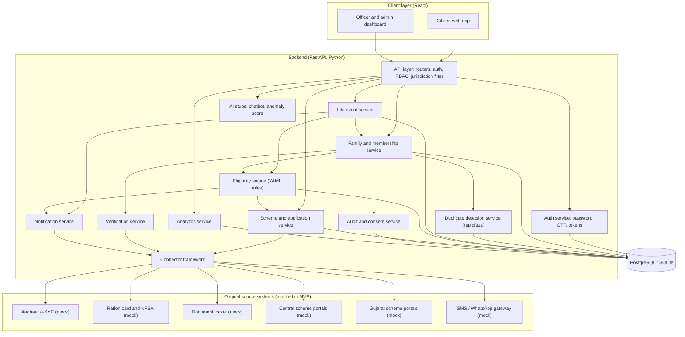
```mermaid
flowchart TB
  subgraph CLIENT["Client layer (React)"]
    CW["Citizen web app"]
    OW["Officer and admin dashboard"]
  end

  subgraph BACKEND["Backend (FastAPI, Python)"]
    API["API layer: routers, auth, RBAC, jurisdiction filter"]
    AUTHS["Auth service: password, OTP, tokens"]
    FAMS["Family and membership service"]
    VERS["Verification service"]
    DUPS["Duplicate detection service (rapidfuzz)"]
    EVTS["Life event service"]
    ELGS["Eligibility engine (YAML rules)"]
    SCHS["Scheme and application service"]
    CONN["Connector framework"]
    NOTS["Notification service"]
    AUDS["Audit and consent service"]
    ANAS["Analytics service"]
    AISS["AI stubs: chatbot, anomaly score"]
  end

  DB[("PostgreSQL / SQLite")]

  subgraph EXT["Original source systems (mocked in MVP)"]
    UID["Aadhaar e-KYC (mock)"]
    RAT["Ration card and NFSA (mock)"]
    DLK["Document locker (mock)"]
    SP1["Central scheme portals (mock)"]
    SP2["Gujarat scheme portals (mock)"]
    SMS["SMS / WhatsApp gateway (mock)"]
  end

  CW --> API
  OW --> API
  API --> AUTHS
  API --> FAMS
  API --> EVTS
  API --> SCHS
  API --> ANAS
  API --> AISS
  FAMS --> VERS
  FAMS --> DUPS
  EVTS --> FAMS
  EVTS --> ELGS
  FAMS --> ELGS
  ELGS --> SCHS
  SCHS --> CONN
  VERS --> CONN
  NOTS --> CONN
  CONN --> UID
  CONN --> RAT
  CONN --> DLK
  CONN --> SP1
  CONN --> SP2
  CONN --> SMS
  AUTHS --> DB
  FAMS --> DB
  DUPS --> DB
  EVTS --> DB
  ELGS --> DB
  SCHS --> DB
  AUDS --> DB
  ANAS --> DB
  FAMS --> AUDS
  EVTS --> NOTS
  ELGS --> NOTS
```

### 6.2 Components

| Component | Responsibility |
|---|---|
| **API layer** | HTTP routing, request validation (Pydantic), authentication, RBAC, jurisdiction filtering, request IDs |
| **Auth service** | Password hashing, OTP challenge and verification, token issue and refresh, lockout |
| **Family and membership service** | Registration, Family ID issue, member add and remove, head management, one-active-membership rule |
| **Verification service** | Aadhaar e-KYC flow through the connector, verification status, hash and last-four storage |
| **Duplicate detection service** | Blocking, scoring and flag creation for persons and families |
| **Life event service** | Event state machine and the effects of each event type, including split |
| **Eligibility engine** | Loads YAML rules, evaluates person and family facts and documents, stores assessments with reasons |
| **Scheme and application service** | Catalog queries and filters, apply-link logging, application tracking |
| **Connector framework** | One adapter per source system behind a common interface (6.3) |
| **Notification service** | Channel-agnostic notification queue. In-app now, SMS and WhatsApp later |
| **Audit and consent service** | Append-only audit log, access logging, consent records |
| **Analytics service** | Aggregations for the officer dashboard, scoped by jurisdiction |
| **AI stubs** | Rule-based chatbot responses and split anomaly scoring |

### 6.3 Connector framework (how "fetch from the original system" works)

The platform never owns scheme master data or application outcomes. It **pulls** them through connectors. In the MVP each connector reads from a mock source (a JSON or database fixture that behaves like a departmental system). In production the same interface is implemented against real APIs, for example through the national API exchange, after the data-sharing agreements and consent flows are in place.

```python
class SourceConnector(Protocol):
    source_system: str                                   # e.g. "PMKISAN", "DIGITAL_GUJARAT"

    def fetch_schemes(self) -> list[SchemeDTO]: ...
    def fetch_application_status(
        self, applicant_token: str, external_ref: str | None = None
    ) -> list[ApplicationStatusDTO]: ...
    def health(self) -> ConnectorHealth: ...
```

| Aspect | Design |
|---|---|
| Sync modes | Scheduled pull (for example every 6 hours) and on-demand refresh when a user opens the tracker |
| Identity passed to sources | A tokenised applicant reference, not the raw Aadhaar number |
| Caching | Each record carries `source_system` and `last_synced_at`. The UI shows both |
| Failure handling | Timeouts and retries with backoff. On failure show last known data with a clear stale-data notice |
| Consent | A connector call for a person is allowed only if consent for that purpose exists. Each call is written to the audit log |
| Apply | The platform does not submit applications. It opens the official link. Status flows back through the connector or through "Link my application" (APP-04) |

### 6.4 Runtime request path

1. Browser sends a request with a bearer token.
2. API layer authenticates, resolves role and jurisdiction, and opens a database session.
3. The service performs the action inside a transaction.
4. Audit rows and notifications are written in the same transaction.
5. Response is returned. Heavy recomputation (eligibility for a family) runs synchronously at demo scale and is designed to move to a background queue at state scale.

### 6.5 Deployment view (free tier)

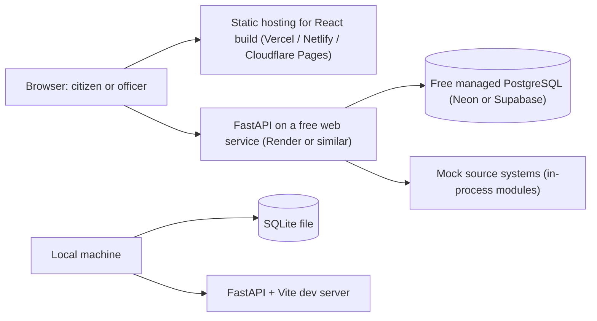
```mermaid
flowchart LR
  U["Browser: citizen or officer"] --> CDN["Static hosting for React build (Vercel / Netlify / Cloudflare Pages)"]
  U --> APIH["FastAPI on a free web service (Render or similar)"]
  APIH --> PG[("Free managed PostgreSQL (Neon or Supabase)")]
  APIH --> MOCK["Mock source systems (in-process modules)"]
  DEV["Local machine"] --> SQL[("SQLite file")]
  DEV --> APIL["FastAPI + Vite dev server"]
```

| Concern | Choice |
|---|---|
| Local | SQLite file and `uvicorn`. Zero setup |
| Hosted | React on a static host, FastAPI on a free web service, PostgreSQL on a free managed tier |
| Database switch | SQLAlchemy with `DATABASE_URL` from the environment. The same code runs on SQLite and PostgreSQL |
| Free-tier caveats | Free web services may sleep when idle, so the first request can be slow. Free databases have size and retention limits. **Check each provider's current free-tier terms before relying on them for the demo**, and keep a recorded video as the safe fallback |

### 6.6 Design for state scale

| Concern | MVP | State-scale design |
|---|---|---|
| Database | Single instance | PostgreSQL with declarative partitioning by `district_code` on `family`, `family_membership`, `audit_log`; read replicas for dashboards |
| Search | SQL `LIKE` and indexes | Dedicated search index (for example OpenSearch) for family and person lookup |
| Eligibility recompute | Synchronous | Event-driven jobs through a message queue with idempotent workers; recompute only the affected families |
| Connectors | In-process | Independent connector workers with per-source rate limits, circuit breakers and retry queues |
| Sessions and cache | In-memory | Redis for tokens, rate limits and hot catalog data |
| Identity data | Hash and last four digits | Tokenisation through an Aadhaar data vault. Application databases hold only reference tokens |
| Family ID serials | Random draw with unique constraint | Pre-generated serial pools per district and year to avoid collisions at volume |
| Deployment | One process | Containerised services behind an API gateway with autoscaling and multi-zone availability |
| Analytics | Live queries | Materialised views or a warehouse refreshed on a schedule |

---

## 7. Family ID design

### 7.1 Format

```
GJ - DD - YY - SSSSSSS - C
│    │    │    │         └─ check digit (Verhoeff)
│    │    │    └─────────── 7-digit non-sequential serial
│    │    └──────────────── year of registration (last two digits)
│    └───────────────────── registration district code (01–99)
└────────────────────────── state prefix
```

**Example:** `GJ-07-26-4831927-1`

The numeric part is **12 digits**: district (2) + year (2) + serial (7) + check digit (1).

### 7.2 Rules

| Rule | Detail |
|---|---|
| Permanent | A Family ID never changes and is never reused, even if the family closes |
| Registration district | The district code is where the family was **registered**. It does not follow the family if it moves. It is for routing and sharding only and is never used for eligibility |
| Non-sequential serial | Random, unused serial per district and year. Prevents guessing neighbouring IDs |
| No personal data | No caste, income, religion, gender or name is encoded |
| Check digit | Verhoeff algorithm detects all single-digit errors and all adjacent transpositions, which are the most common typing mistakes |
| Collisions | Unique constraint on `family_id`. On conflict, draw again |
| Split families | A new family gets a new ID. The link to the source family is stored in lineage, not in the ID |
| Input handling | Users may type with or without hyphens and spaces. The system normalises to uppercase and strips separators |
| Validation regex | `^GJ-\d{2}-\d{2}-\d{7}-\d$` after formatting |
| District codes | Internal codes 01–33 assigned in alphabetical order to the districts in the seed master. Newly formed districts take the next free code. Map to official LGD codes in production |

### 7.3 Reference implementation

```python
import secrets

_d = [
    [0,1,2,3,4,5,6,7,8,9],[1,2,3,4,0,6,7,8,9,5],[2,3,4,0,1,7,8,9,5,6],
    [3,4,0,1,2,8,9,5,6,7],[4,0,1,2,3,9,5,6,7,8],[5,9,8,7,6,0,4,3,2,1],
    [6,5,9,8,7,1,0,4,3,2],[7,6,5,9,8,2,1,0,4,3],[8,7,6,5,9,3,2,1,0,4],
    [9,8,7,6,5,4,3,2,1,0],
]
_p = [
    [0,1,2,3,4,5,6,7,8,9],[1,5,7,6,2,8,3,0,9,4],[5,8,0,3,7,9,6,1,4,2],
    [8,9,1,6,0,4,3,5,2,7],[9,4,5,3,1,2,6,8,7,0],[4,2,8,6,5,7,3,9,0,1],
    [2,7,9,3,8,0,6,4,1,5],[7,0,4,6,9,1,3,2,5,8],
]
_inv = [0,4,3,2,1,5,6,7,8,9]

def verhoeff_check_digit(num: str) -> str:
    c = 0
    for i, ch in enumerate(reversed(num)):
        c = _d[c][_p[(i + 1) % 8][int(ch)]]
    return str(_inv[c])

def verhoeff_valid(num: str) -> bool:
    c = 0
    for i, ch in enumerate(reversed(num)):
        c = _d[c][_p[i % 8][int(ch)]]
    return c == 0

def new_family_id(district_code: int, year: int, taken: set[str]) -> str:
    while True:
        serial = f"{secrets.randbelow(10**7):07d}"
        body = f"{district_code:02d}{year % 100:02d}{serial}"
        fid = f"GJ-{body[:2]}-{body[2:4]}-{body[4:]}-{verhoeff_check_digit(body)}"
        if fid not in taken:            # DB unique constraint is the real guard
            return fid

def is_valid_family_id(fid: str) -> bool:
    digits = "".join(ch for ch in fid.upper() if ch.isdigit())
    return fid.upper().replace(" ", "").startswith("GJ") and len(digits) == 12 and verhoeff_valid(digits)
```

Check: the digits `07264831927` produce check digit `1`, giving `GJ-07-26-4831927-1`.

### 7.4 Person identifiers

| Identifier | Purpose |
|---|---|
| `person_id` (UUID) | Internal permanent key. Never shown to citizens |
| Aadhaar keyed hash | Duplicate detection only. Not reversible without the server-side secret |
| Member number (`M01`, `M02`…) | Display label within a family. Changes if the person moves family |

---

## 8. Domain and business rules

### 8.1 Family lifecycle

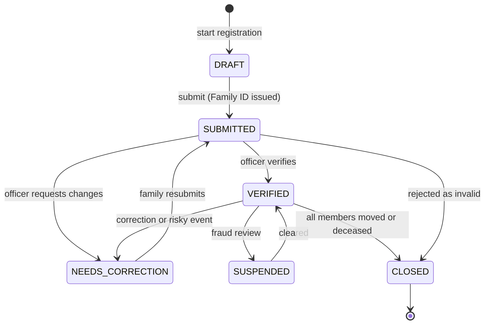
```mermaid
stateDiagram-v2
  [*] --> DRAFT: start registration
  DRAFT --> SUBMITTED: submit (Family ID issued)
  SUBMITTED --> VERIFIED: officer verifies
  SUBMITTED --> NEEDS_CORRECTION: officer requests changes
  NEEDS_CORRECTION --> SUBMITTED: family resubmits
  VERIFIED --> NEEDS_CORRECTION: correction or risky event
  VERIFIED --> SUSPENDED: fraud review
  SUSPENDED --> VERIFIED: cleared
  VERIFIED --> CLOSED: all members moved or deceased
  SUBMITTED --> CLOSED: rejected as invalid
  CLOSED --> [*]
```

### 8.2 Membership rules

| ID | Rule |
|---|---|
| BR-M1 | A person has **at most one active membership**. Active means `end_date IS NULL`. Enforced by a partial unique index on `person_id` |
| BR-M2 | Membership rows are never deleted. Leaving a family sets `end_date` and `end_reason` |
| BR-M3 | On a move, the old membership ends and the new one starts on the **same effective date**, so there is no gap and no overlap |
| BR-M4 | Every active family has exactly one active head, who must be a verified adult |
| BR-M5 | If the head dies or leaves, headship passes to the spouse if a verified adult, else the eldest verified adult child, else an officer assigns one |
| BR-M6 | Dependents (under 18, or flagged as dependent) have no login and are managed by the head |
| BR-M7 | A family with no active members becomes `CLOSED`. Its ID stays reserved |
| BR-M8 | Membership `start_reason` and `end_reason` come from a fixed list: `REGISTRATION`, `BIRTH`, `MARRIAGE`, `SPLIT`, `MERGE`, `MIGRATION`, `JOIN_APPROVED`, `DEATH`, `CORRECTION` |

### 8.3 Registration and verification rules

| ID | Rule |
|---|---|
| BR-R1 | Registration can be started by an adult member or by an officer. An officer registration marks `registered_by` and requires each adult to claim their account with an OTP |
| BR-R2 | The Family ID is issued on submission. Status is `SUBMITTED` until an officer verifies the household |
| BR-R3 | A member is `VERIFIED` only after Aadhaar e-KYC succeeds. Only `VERIFIED` members can apply for schemes |
| BR-R4 | Family verification (by an officer) and member verification (Aadhaar) are separate. Both are visible to the citizen |
| BR-R5 | Mandatory consents are captured before submission |

### 8.4 Duplicate detection

**Goal:** a real person appears once, in one family at a time.

1. **Hard match:** the Aadhaar keyed hash equals an existing person. Do not create a second person. Explain: the person already belongs to another family, so use *leave family* (split) or *join request*.
2. **Fuzzy match** for cases without a hash match or with typos:
   - **Blocking** to avoid comparing everyone with everyone: candidates must share at least one of DOB year, mobile number, or pincode.
   - **Normalisation:** lowercase, strip honorifics and common suffixes (for example *bhai*, *ben*, *kumar*, *shri*, *smt*), collapse spaces, and apply a simple phonetic key for common transliteration variants.
   - **Scoring:**

| Signal | Weight |
|---|---|
| Name similarity (`rapidfuzz` token-sort ratio) | 0.40 |
| Date of birth (exact = 1, year and month = 0.6, year only = 0.3) | 0.25 |
| Mobile number match | 0.15 |
| Address similarity | 0.15 |
| Gender match | 0.05 |

   - **Thresholds:** score ≥ 0.90 blocks the action and opens a `HIGH` flag; 0.75–0.90 opens a `MEDIUM` flag for officer review; below 0.75 passes.
3. **Officer resolution:** `NOT_DUPLICATE`, `CONFIRMED_DUPLICATE` (records are merged and the surviving record keeps full history), or `NEEDS_INFO`.

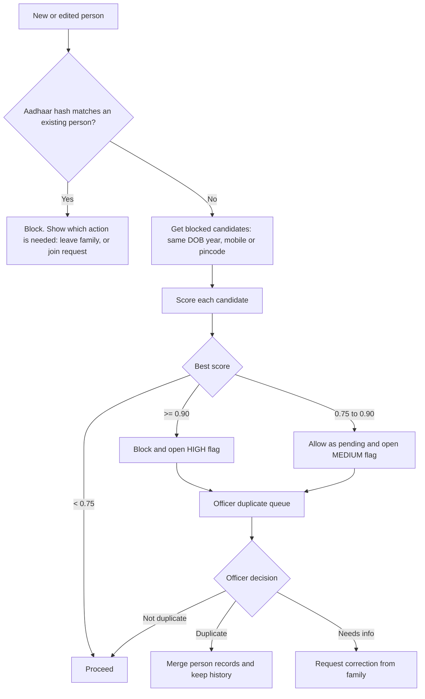
```mermaid
flowchart TD
  A["New or edited person"] --> B{"Aadhaar hash matches an existing person?"}
  B -- Yes --> C["Block. Show which action is needed: leave family, or join request"]
  B -- No --> D["Get blocked candidates: same DOB year, mobile or pincode"]
  D --> E["Score each candidate"]
  E --> F{"Best score"}
  F -- ">= 0.90" --> G["Block and open HIGH flag"]
  F -- "0.75 to 0.90" --> H["Allow as pending and open MEDIUM flag"]
  F -- "< 0.75" --> I["Proceed"]
  G --> J["Officer duplicate queue"]
  H --> J
  J --> K{"Officer decision"}
  K -- "Not duplicate" --> I
  K -- "Duplicate" --> L["Merge person records and keep history"]
  K -- "Needs info" --> M["Request correction from family"]
```

### 8.5 Split rules

A **split** is used when adult children (or any adult group) form a separate household.

| ID | Rule |
|---|---|
| BR-S1 | Requester is an adult (18+) verified member, or the head. Turning 18 does **not** split anyone automatically |
| BR-S2 | The split group contains the requester, their spouse if in the family, and their dependent children. Others can be added if they consent |
| BR-S3 | The new household needs its own address (or a declared shared address with a flag), and an optional supporting document (ration card, rent agreement, utility bill) |
| BR-S4 | The source family keeps its ID and history. The new family gets a new Family ID |
| BR-S5 | All moved members' memberships end in the source family with `end_reason = SPLIT` and start in the new family on the same date (BR-M3) |
| BR-S6 | A lineage row records `source_family → new_family` with the event ID |
| BR-S7 | Eligibility is recomputed for both families. Existing enrollments that no longer qualify are flagged for review, not silently removed |
| BR-S8 | Head rules (BR-M4, BR-M5) apply to both families after the split |
| BR-S9 | An anomaly score (8.6) decides whether the split is auto-approved or sent to an officer |

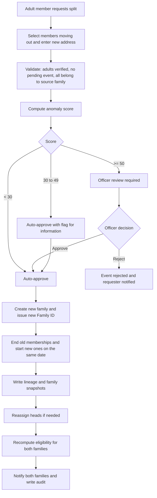
```mermaid
flowchart TD
  A["Adult member requests split"] --> B["Select members moving out and enter new address"]
  B --> C["Validate: adults verified, no pending event, all belong to source family"]
  C --> D["Compute anomaly score"]
  D --> E{"Score"}
  E -- "< 30" --> F["Auto-approve"]
  E -- "30 to 49" --> G["Auto-approve with flag for information"]
  E -- ">= 50" --> H["Officer review required"]
  H --> I{"Officer decision"}
  I -- Reject --> Z["Event rejected and requester notified"]
  I -- Approve --> F
  G --> F
  F --> J["Create new family and issue new Family ID"]
  J --> K["End old memberships and start new ones on the same date"]
  K --> L["Write lineage and family snapshots"]
  L --> M["Reassign heads if needed"]
  M --> N["Recompute eligibility for both families"]
  N --> O["Notify both families and write audit"]
```

### 8.6 Split anomaly scoring (rule-based, demo)

The score is the capped sum (0–100) of triggered signals. It routes a split for review and never rejects it automatically.

| Signal | Points |
|---|---|
| New family address is the same as the source family address | 30 |
| Split within 90 days of a scheme application or approval for the source family | 20 |
| New family's declared income band is lower than the source's per-capita band | 20 |
| Any moving member joined or left a family in the last 24 months | 25 |
| New family's only adult shares a mobile number with the source head | 15 |
| Three or more splits from the same source family in 12 months | 20 |

### 8.7 Other life events

| Event | Preconditions | Effects | Approval |
|---|---|---|---|
| **Birth** | Birth certificate record. Parent is an active member | New person and membership (`BIRTH`). Aadhaar verification via guardian later. Recompute family schemes (for example child and education schemes) | Auto if a certificate is verified, else officer |
| **Death** | Death certificate record or officer entry | Membership ends (`DEATH`), person marked deceased, login disabled, applications stopped, head reassigned if needed, recompute | Officer |
| **Marriage** | Marriage certificate, both persons verified | Move the person to the spouse's family, or create a new family for the couple (this is a split with reason `MARRIAGE`). Previous membership must end first | Auto with certificate, else officer |
| **Merge** | Two families, agreement of both heads | Selected members move to the target family (`MERGE`). Source family closes if empty. Lineage stores `MERGED_INTO` | Officer |
| **Migration** | New address. Outside Gujarat requires a portability request | Address updated with history. District change updates jurisdiction and the family moves to the new officer's queue. **Family ID does not change** | Auto within Gujarat, officer for out-of-state |
| **Income change** | New income band and a supporting document | Update family income fields with history. Recompute eligibility | Officer for large changes |
| **Head change** | Nominee is a verified adult in the family | Head role transferred | Auto if the current head consents, else officer |

### 8.8 Eligibility model

- Each scheme declares an **eligibility unit**: `FAMILY` or `INDIVIDUAL`.
- For an individual scheme the engine evaluates each **verified** member. For a family scheme it evaluates the household using its verified members and family attributes.
- Rule facts come from person fields, family fields and **verified documents**.
- Result per assessment: `AUTO_ELIGIBLE`, `AUTO_INELIGIBLE` or `DOCS_NEEDED`, with per-rule reasons.
- An officer then confirms or rejects. Only an `OFFICER_CONFIRMED` result is shown as *Confirmed eligible*.
- Re-evaluation happens on: profile change, document change, life event, and rule version change.

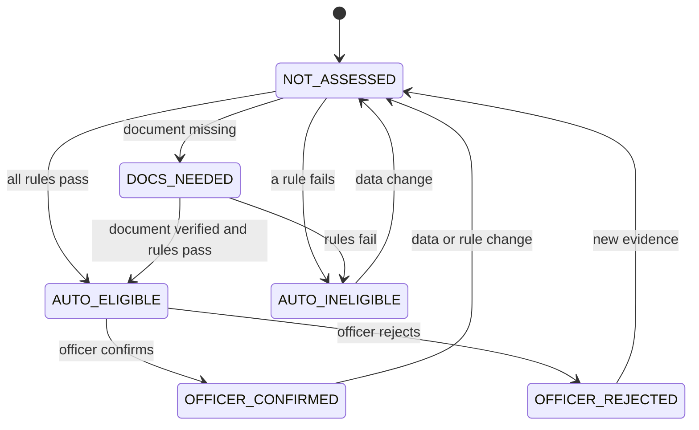
```mermaid
stateDiagram-v2
  [*] --> NOT_ASSESSED
  NOT_ASSESSED --> AUTO_ELIGIBLE: all rules pass
  NOT_ASSESSED --> AUTO_INELIGIBLE: a rule fails
  NOT_ASSESSED --> DOCS_NEEDED: document missing
  DOCS_NEEDED --> AUTO_ELIGIBLE: document verified and rules pass
  DOCS_NEEDED --> AUTO_INELIGIBLE: rules fail
  AUTO_ELIGIBLE --> OFFICER_CONFIRMED: officer confirms
  AUTO_ELIGIBLE --> OFFICER_REJECTED: officer rejects
  OFFICER_CONFIRMED --> NOT_ASSESSED: data or rule change
  OFFICER_REJECTED --> NOT_ASSESSED: new evidence
  AUTO_INELIGIBLE --> NOT_ASSESSED: data change
```

### 8.9 Application status model

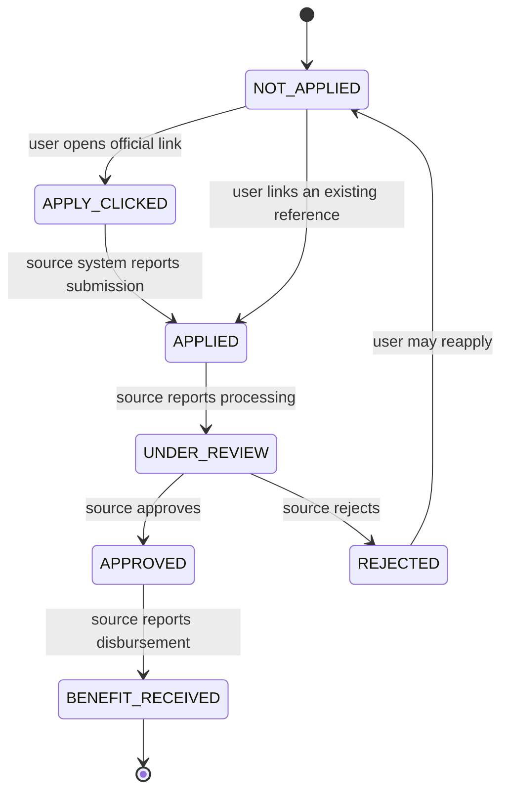
```mermaid
stateDiagram-v2
  [*] --> NOT_APPLIED
  NOT_APPLIED --> APPLY_CLICKED: user opens official link
  APPLY_CLICKED --> APPLIED: source system reports submission
  NOT_APPLIED --> APPLIED: user links an existing reference
  APPLIED --> UNDER_REVIEW: source reports processing
  UNDER_REVIEW --> APPROVED: source approves
  UNDER_REVIEW --> REJECTED: source rejects
  APPROVED --> BENEFIT_RECEIVED: source reports disbursement
  REJECTED --> NOT_APPLIED: user may reapply
  BENEFIT_RECEIVED --> [*]
```

### 8.10 History and retention

- Memberships, events, assessments, documents' verification status, address changes and family snapshots are **append-only**.
- Family snapshots (`family_version`) store a JSON copy of the family and its active memberships at each change, so a **point-in-time view** can be rebuilt.
- Soft deletes only. Deceased persons remain in history.
- Audit logs are append-only. Retention periods are a policy decision listed in Section 22.

---

## 9. Data schema

### 9.1 Design principles

- **Person, family and membership are separate.** A person exists once for life. A family is a household. A membership is a dated link between them.
- **History is data.** Nothing that describes a household at a point in time is overwritten without a versioned record.
- **One active family per person** is enforced in the database, not just in code.
- **Sensitive fields are minimised and protected** (Section 14).
- **Portable SQL.** Types and constraints work on both SQLite (local) and PostgreSQL (hosted). JSON columns hold flexible payloads.

### 9.2 Entity-relationship diagram

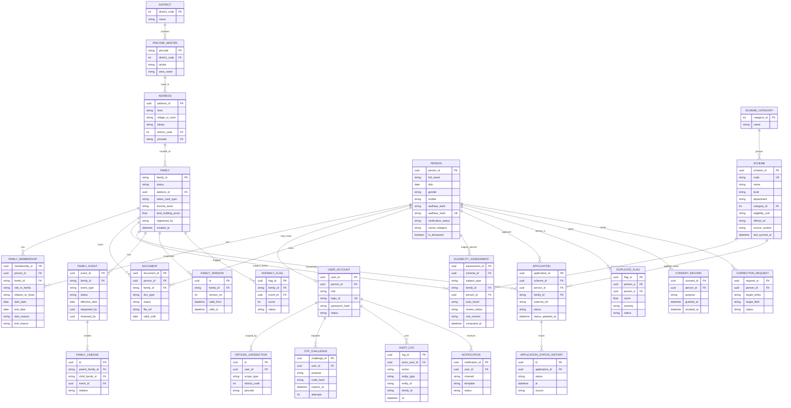
```mermaid
erDiagram
  DISTRICT ||--o{ PINCODE_MASTER : contains
  PINCODE_MASTER ||--o{ ADDRESS : used_in
  ADDRESS ||--o{ FAMILY : located_at

  PERSON ||--o{ FAMILY_MEMBERSHIP : has
  FAMILY ||--o{ FAMILY_MEMBERSHIP : has
  PERSON ||--o| USER_ACCOUNT : may_have
  USER_ACCOUNT ||--o{ OFFICER_JURISDICTION : scoped_by
  USER_ACCOUNT ||--o{ OTP_CHALLENGE : requests

  PERSON ||--o{ DOCUMENT : owns
  FAMILY ||--o{ DOCUMENT : owns

  SCHEME_CATEGORY ||--o{ SCHEME : groups
  SCHEME ||--o{ ELIGIBILITY_ASSESSMENT : assessed_for
  FAMILY ||--o{ ELIGIBILITY_ASSESSMENT : subject_family
  PERSON ||--o{ ELIGIBILITY_ASSESSMENT : subject_person

  SCHEME ||--o{ APPLICATION : applied_under
  PERSON ||--o{ APPLICATION : applicant
  FAMILY ||--o{ APPLICATION : household
  APPLICATION ||--o{ APPLICATION_STATUS_HISTORY : tracks

  FAMILY ||--o{ FAMILY_EVENT : has
  FAMILY_EVENT ||--o{ FAMILY_LINEAGE : creates
  FAMILY ||--o{ FAMILY_VERSION : snapshots
  FAMILY ||--o{ ANOMALY_FLAG : flagged

  PERSON ||--o{ DUPLICATE_FLAG : person_a
  PERSON ||--o{ CONSENT_RECORD : gives
  PERSON ||--o{ CORRECTION_REQUEST : raises
  USER_ACCOUNT ||--o{ AUDIT_LOG : acts
  USER_ACCOUNT ||--o{ NOTIFICATION : receives

  DISTRICT {
    int district_code PK
    string name
  }
  PINCODE_MASTER {
    string pincode PK
    int district_code FK
    string taluka
    string area_name
  }
  ADDRESS {
    uuid address_id PK
    string line1
    string village_or_town
    string taluka
    int district_code FK
    string pincode FK
  }
  PERSON {
    uuid person_id PK
    string full_name
    date dob
    string gender
    string mobile
    string aadhaar_last4
    string aadhaar_hash UK
    string verification_status
    string social_category
    boolean is_deceased
  }
  FAMILY {
    string family_id PK
    string status
    uuid address_id FK
    string ration_card_type
    string income_band
    float land_holding_acres
    string registered_by
    datetime created_at
  }
  FAMILY_MEMBERSHIP {
    uuid membership_id PK
    uuid person_id FK
    string family_id FK
    string role_in_family
    string relation_to_head
    date start_date
    date end_date
    string start_reason
    string end_reason
  }
  USER_ACCOUNT {
    uuid user_id PK
    uuid person_id FK
    string role
    string login_id UK
    string password_hash
    string status
  }
  OFFICER_JURISDICTION {
    uuid id PK
    uuid user_id FK
    string scope_type
    int district_code
    string pincode
  }
  OTP_CHALLENGE {
    uuid challenge_id PK
    uuid user_id FK
    string purpose
    string code_hash
    datetime expires_at
    int attempts
  }
  DOCUMENT {
    uuid document_id PK
    uuid person_id FK
    string family_id FK
    string doc_type
    string status
    string file_ref
    date valid_until
  }
  SCHEME_CATEGORY {
    int category_id PK
    string name
  }
  SCHEME {
    uuid scheme_id PK
    string code UK
    string name
    string level
    string department
    int category_id FK
    string eligibility_unit
    string official_url
    string source_system
    datetime last_synced_at
  }
  ELIGIBILITY_ASSESSMENT {
    uuid assessment_id PK
    uuid scheme_id FK
    string subject_type
    string family_id FK
    uuid person_id FK
    string auto_result
    string review_status
    string rule_version
    datetime computed_at
  }
  APPLICATION {
    uuid application_id PK
    uuid scheme_id FK
    uuid person_id FK
    string family_id FK
    string external_ref
    string status
    datetime status_updated_at
  }
  APPLICATION_STATUS_HISTORY {
    uuid id PK
    uuid application_id FK
    string status
    datetime at
    string source
  }
  FAMILY_EVENT {
    uuid event_id PK
    string family_id FK
    string event_type
    string status
    date effective_date
    uuid requested_by
    uuid reviewed_by
  }
  FAMILY_LINEAGE {
    uuid id PK
    string parent_family_id FK
    string child_family_id FK
    uuid event_id FK
    string relation
  }
  FAMILY_VERSION {
    uuid id PK
    string family_id FK
    int version_no
    datetime valid_from
    datetime valid_to
  }
  DUPLICATE_FLAG {
    uuid flag_id PK
    uuid person_a FK
    uuid person_b FK
    float score
    string severity
    string status
  }
  ANOMALY_FLAG {
    uuid flag_id PK
    string family_id FK
    uuid event_id FK
    int score
    string status
  }
  CONSENT_RECORD {
    uuid consent_id PK
    uuid person_id FK
    string purpose
    datetime granted_at
    datetime revoked_at
  }
  CORRECTION_REQUEST {
    uuid request_id PK
    uuid person_id FK
    string target_entity
    string target_field
    string status
  }
  AUDIT_LOG {
    uuid log_id PK
    uuid actor_user_id FK
    string action
    string entity_type
    string entity_id
    string family_id
    datetime at
  }
  NOTIFICATION {
    uuid notification_id PK
    uuid user_id FK
    string channel
    string template
    string status
  }
```

### 9.3 Data dictionary

#### `person`

| Column | Type | Notes |
|---|---|---|
| person_id | UUID PK | Permanent internal key |
| full_name | text | Required. English now; `full_name_local` added for Gujarati later |
| dob | date | Required |
| gender | enum | `MALE`, `FEMALE`, `OTHER` |
| marital_status | enum | `UNMARRIED`, `MARRIED`, `WIDOWED`, `DIVORCED`, `SEPARATED` |
| mobile | text | Login and OTP channel. Masked in lists |
| email | text | Optional |
| aadhaar_last4 | char(4) | Display only |
| aadhaar_hash | text, unique, nullable | Keyed HMAC-SHA-256 of the number for duplicate matching. Full number is never stored |
| verification_status | enum | `UNVERIFIED`, `VERIFIED`, `FAILED` |
| verified_at | timestamp | |
| social_category | enum | `GENERAL`, `SC`, `ST`, `SEBC`, `OBC`, `EWS`. Sensitive. Used only by category-based scheme rules |
| education_level | enum | `NONE`, `PRIMARY`, `SECONDARY`, `HIGHER_SECONDARY`, `GRADUATE`, `POST_GRADUATE`, `DIPLOMA_ITI` |
| is_student | boolean | With `current_course_level` when true |
| occupation_type | enum | `FARMER`, `LABOUR`, `ARTISAN`, `SELF_EMPLOYED`, `SALARIED`, `HOMEMAKER`, `UNEMPLOYED`, `RETIRED`, `OTHER` |
| disability_type | enum, nullable | |
| disability_percent | int, nullable | 0–100 |
| has_bank_account | boolean | Bank-account status only. No account numbers |
| domicile_gujarat | boolean | |
| is_deceased | boolean | With `date_of_death` |
| created_at, updated_at | timestamp | |

#### `family`

| Column | Type | Notes |
|---|---|---|
| family_id | text PK | Structured ID (Section 7) |
| status | enum | `DRAFT`, `SUBMITTED`, `VERIFIED`, `NEEDS_CORRECTION`, `SUSPENDED`, `CLOSED` |
| address_id | UUID FK | Current address. History in `family_version` |
| ration_card_number | text | Stored masked in views |
| ration_card_type | enum | `AAY`, `PHH`, `NON_NFSA`, `NONE` |
| annual_income_amount | numeric, nullable | Declared |
| income_band | enum | `LT_1L`, `1L_2_5L`, `2_5L_5L`, `5L_8L`, `GT_8L` |
| land_holding_acres | numeric | |
| house_type | enum | `KUCCHA`, `SEMI_PUCCA`, `PUCCA`, `NONE` |
| house_owned | boolean | |
| has_lpg_connection | boolean | |
| primary_occupation | enum | Household main livelihood |
| registered_by | enum | `SELF`, `OFFICER` with `registered_by_user_id` |
| verified_by, verified_at | UUID, timestamp | Officer verification |
| created_at, closed_at | timestamp | |

#### `family_membership`

| Column | Type | Notes |
|---|---|---|
| membership_id | UUID PK | |
| person_id | UUID FK | |
| family_id | text FK | |
| role_in_family | enum | `HEAD`, `ADULT`, `DEPENDENT` |
| relation_to_head | enum | `SELF`, `SPOUSE`, `SON`, `DAUGHTER`, `FATHER`, `MOTHER`, `BROTHER`, `SISTER`, `DAUGHTER_IN_LAW`, `SON_IN_LAW`, `GRANDCHILD`, `OTHER` |
| start_date | date | |
| end_date | date, nullable | `NULL` means active |
| start_reason, end_reason | enum | See BR-M8 |
| event_id | UUID FK, nullable | Event that caused the change |

#### `user_account` and related

| Column | Type | Notes |
|---|---|---|
| user_id | UUID PK | |
| person_id | UUID FK, nullable | Set for citizens, null for officers |
| role | enum | `CITIZEN_HEAD`, `CITIZEN_MEMBER`, `FIELD_OFFICER`, `DISTRICT_OFFICER`, `STATE_ADMIN`, `AUDITOR` |
| login_id | text unique | Mobile for citizens, email or username for officers |
| password_hash | text | Argon2 |
| status | enum | `ACTIVE`, `LOCKED`, `DISABLED`, `PENDING_CLAIM` |
| `officer_jurisdiction` | | `scope_type` (`STATE`, `DISTRICT`, `PINCODE`), `district_code`, `pincode` |
| `otp_challenge` | | `purpose` (`LOGIN`, `RESET`, `CLAIM`, `AADHAAR_KYC`), `code_hash`, `expires_at`, `attempts`, `used_at` |

The citizen's `CITIZEN_HEAD` or `CITIZEN_MEMBER` role is derived from the active membership at login, so it stays correct after a split.

#### `document`

| Column | Type | Notes |
|---|---|---|
| document_id | UUID PK | |
| person_id / family_id | FK, one required | Owner |
| doc_type | enum | `RATION_CARD`, `INCOME_CERT`, `BIRTH_CERT`, `DEATH_CERT`, `MARRIAGE_CERT`, `CASTE_CERT`, `DISABILITY_CERT`, `LAND_RECORD`, `BANK_PASSBOOK`, `RESIDENCE_PROOF`, `STUDENT_PROOF` |
| status | enum | `UPLOADED`, `VERIFIED`, `REJECTED`, `EXPIRED` |
| file_ref | text | Reference to a mock file, never raw content in the demo |
| valid_until | date, nullable | |
| verified_by, verified_at | | Officer or mock document locker |

#### `scheme` and `scheme_category`

| Column | Type | Notes |
|---|---|---|
| scheme_id | UUID PK | |
| code | text unique | For example `PMKISAN` |
| name, short_description, benefit_summary | text | |
| level | enum | `CENTRAL`, `STATE` (Gujarat Government) |
| department | text | |
| category_id | FK | Categories in Section 12.4 |
| benefit_type | enum | `CASH`, `IN_KIND`, `INSURANCE`, `SUBSIDY`, `LOAN`, `SERVICE` |
| eligibility_unit | enum | `FAMILY`, `INDIVIDUAL` |
| target_groups | JSON array | For filters, for example `["FARMER","WOMEN"]` |
| rules_key | text | Key of the YAML rule file |
| rule_version | text | |
| official_url | text | Apply link |
| require_officer_confirmation_before_apply | boolean | Default false |
| source_system, last_synced_at, is_active | | Connector metadata |

#### `eligibility_assessment`

| Column | Type | Notes |
|---|---|---|
| assessment_id | UUID PK | |
| scheme_id | FK | |
| subject_type | enum | `FAMILY`, `PERSON` |
| family_id / person_id | FK | Subject. `family_id` is always stored for jurisdiction routing |
| auto_result | enum | `AUTO_ELIGIBLE`, `AUTO_INELIGIBLE`, `DOCS_NEEDED` |
| reasons | JSON | Per-rule pass or fail with values |
| missing_docs | JSON | |
| review_status | enum | `PENDING`, `OFFICER_CONFIRMED`, `OFFICER_REJECTED`, `NOT_REQUIRED` |
| reviewed_by, reviewed_at, remarks | | |
| rule_version, computed_at | | For reproducibility |
| is_current | boolean | Older assessments kept as history |

#### `application` and `application_status_history`

| Column | Type | Notes |
|---|---|---|
| application_id | UUID PK | |
| scheme_id, person_id, family_id | FK | `person_id` is the applicant |
| external_ref | text, nullable | Reference number on the official portal |
| status | enum | `NOT_APPLIED`, `APPLY_CLICKED`, `APPLIED`, `UNDER_REVIEW`, `APPROVED`, `REJECTED`, `BENEFIT_RECEIVED` |
| apply_clicked_at, status_updated_at | timestamp | |
| source_system, last_synced_at | | |
| history rows | | `status`, `at`, `source` (`USER`, `CONNECTOR`, `OFFICER`) |

#### `family_event`, `family_lineage`, `family_version`

| Table | Key columns |
|---|---|
| `family_event` | `event_id`, `family_id`, `event_type` (`BIRTH`, `DEATH`, `MARRIAGE`, `SPLIT`, `MERGE`, `MIGRATION`, `INCOME_CHANGE`, `HEAD_CHANGE`), `status` (`PENDING`, `UNDER_REVIEW`, `APPROVED`, `REJECTED`, `APPLIED`), `payload` JSON, `effective_date`, `requested_by`, `reviewed_by`, `reviewed_at`, `remarks` |
| `family_lineage` | `parent_family_id`, `child_family_id`, `event_id`, `relation` (`SPLIT_FROM`, `MERGED_INTO`) |
| `family_version` | `family_id`, `version_no`, `snapshot` JSON (family fields and active memberships), `valid_from`, `valid_to`, `changed_by`, `event_id` |

#### Flags, consent, corrections, audit, notifications

| Table | Key columns |
|---|---|
| `duplicate_flag` | `person_a`, `person_b`, `score`, `severity` (`HIGH`, `MEDIUM`), `reasons` JSON, `status` (`OPEN`, `NOT_DUPLICATE`, `CONFIRMED_DUPLICATE`, `NEEDS_INFO`), `resolved_by`, `resolved_at` |
| `anomaly_flag` | `family_id`, `event_id`, `score`, `signals` JSON, `status` (`OPEN`, `CLEARED`, `CONFIRMED`) |
| `consent_record` | `person_id`, `purpose` (`REGISTRATION`, `ELIGIBILITY_CHECK`, `SCHEME_SYNC`, `NOTIFICATIONS`), `mandatory`, `granted_at`, `revoked_at` |
| `correction_request` | `person_id`, `family_id`, `target_entity`, `target_field`, `old_value`, `new_value`, `reason`, `evidence_document_id`, `status` (`OPEN`, `APPROVED`, `REJECTED`), `reviewed_by`, `remarks` |
| `audit_log` | `actor_user_id`, `actor_role`, `action` (`CREATE`, `UPDATE`, `VIEW`, `APPROVE`, `LOGIN`, …), `entity_type`, `entity_id`, `family_id`, `purpose`, `ip`, `at`, `details` JSON |
| `notification` | `user_id`, `channel` (`IN_APP`, `SMS`, `WHATSAPP`), `template`, `payload` JSON, `status`, `created_at`, `read_at` |
| `district`, `pincode_master` | District list and pincode-to-district-and-taluka map (synthetic ranges in the demo) |

### 9.4 Constraints and indexes

| Purpose | Definition |
|---|---|
| One active family per person | `CREATE UNIQUE INDEX ux_membership_active_person ON family_membership(person_id) WHERE end_date IS NULL;` |
| One active head per family | `CREATE UNIQUE INDEX ux_membership_active_head ON family_membership(family_id) WHERE end_date IS NULL AND role_in_family = 'HEAD';` |
| No duplicate identities | `UNIQUE(person.aadhaar_hash)` where not null |
| Unique Family ID | Primary key on `family.family_id` plus a format check |
| Valid date ranges | `CHECK (end_date IS NULL OR end_date >= start_date)` |
| One current assessment | Partial unique index on `(scheme_id, subject_type, COALESCE(person_id, family_id))` where `is_current` |
| Dashboard speed | Indexes on `address(district_code, pincode)`, `family(status)`, `family_membership(family_id) WHERE end_date IS NULL`, `eligibility_assessment(family_id, scheme_id)`, `application(family_id, status)`, `audit_log(entity_type, entity_id, at)` |

Both partial unique indexes work on SQLite and PostgreSQL.

### 9.5 Sensitive data classification

| Field | Class | Handling |
|---|---|---|
| Aadhaar number | Restricted | Never stored. Keyed hash and last four only |
| Mobile number | Personal | Masked in lists (`98XXXXXX21`). Full value only for the owner and for OTP |
| Social category, disability, income | Sensitive personal | Visible only to the family and to officers with jurisdiction and purpose. Access logged |
| Ration card number | Personal | Masked in lists |
| Address | Personal | Officer access within jurisdiction only |
| Documents | Personal | Reference only in the demo. Encrypted object storage in production |
| Audit logs | Operational | Append-only. Contain no full identifiers |

---

## 10. Application flows and screens

### 10.1 Use case diagram

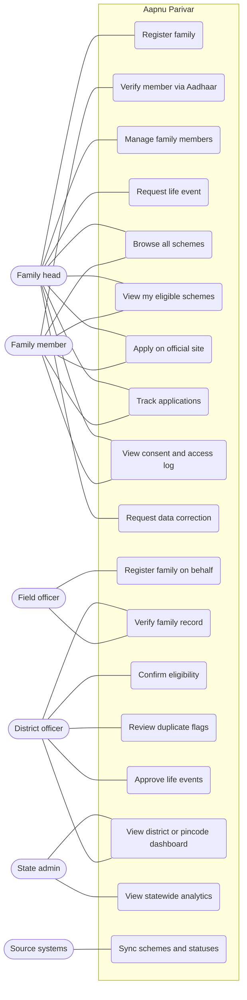
```mermaid
flowchart LR
  H(["Family head"])
  M(["Family member"])
  FO(["Field officer"])
  DO(["District officer"])
  SA(["State admin"])
  SRC(["Source systems"])

  subgraph SYS["Aapnu Parivar"]
    U1("Register family")
    U2("Verify member via Aadhaar")
    U3("Manage family members")
    U4("Request life event")
    U5("Browse all schemes")
    U6("View my eligible schemes")
    U7("Apply on official site")
    U8("Track applications")
    U9("View consent and access log")
    U10("Request data correction")
    U11("Register family on behalf")
    U12("Verify family record")
    U13("Confirm eligibility")
    U14("Review duplicate flags")
    U15("Approve life events")
    U16("View district or pincode dashboard")
    U17("View statewide analytics")
    U18("Sync schemes and statuses")
  end

  H --- U1
  H --- U3
  H --- U4
  H --- U10
  M --- U2
  M --- U5
  M --- U6
  M --- U7
  M --- U8
  M --- U9
  H --- U5
  H --- U6
  H --- U7
  H --- U8
  H --- U9
  FO --- U11
  FO --- U12
  DO --- U12
  DO --- U13
  DO --- U14
  DO --- U15
  DO --- U16
  SA --- U17
  SA --- U16
  SRC --- U18
```

### 10.2 Screen inventory

**Entry screen (before login):** *Find your family.* Enter a Family ID or mobile number to log in, or choose **Register a new family**. The Family ID is validated live with its check digit.

#### Citizen screens

| Route | Screen | Purpose | Key requirements |
|---|---|---|---|
| `/` | Find your family | Family ID or mobile lookup, login, register | AUTH-01, AUTH-02 |
| `/login` | Login | Password or OTP. Forgot password uses OTP | AUTH-01, AUTH-02 |
| `/register` | Register family (stepper) | Head, members, address and ration card, income and land, consent, review and submit | REG-01 to REG-07 |
| `/home` | Family dashboard | Family card, verification summary, eligible count, applications summary, pending items | CDASH-01 |
| `/family/members` | Members | List, verification status, add member, per-member Aadhaar verification | FAM-02, VER-01 |
| `/family/members/:id` | Member detail | Profile, documents, eligibility for that person, timeline | HIST-02 |
| `/schemes/mine` | My schemes | Eligible, Documents needed, Not eligible, with badges and reasons | SCH-04, ELG-06, ELG-08 |
| `/schemes` | All schemes | Category tabs, default filters, search, Central and State badges | SCH-02, SCH-05 |
| `/schemes/:code` | Scheme detail | Benefits, eligibility summary, rules explanation, apply button | SCH-03, APP-01 |
| `/applications` | Application tracker | All members' applications with status timeline and filters | APP-02, APP-05 |
| `/events` | Life events | Start an event, see pending and past events | EVT-01 to EVT-09 |
| `/events/split` | Split wizard | Select members, new address, evidence, preview and submit | EVT-04 |
| `/requests` | Data correction | Request form and status list | CORR-01 |
| `/privacy` | Consent and access log | Consents, who accessed what and why | CON-01 to CON-04 |
| `/notifications` | Notifications | In-app messages | NOT-01 |
| `/assistant` | Aapnu Sahayak (stub) | Rule-based chatbot demo | AI-01 |
| `/settings` | Profile and security | Change password, OTP settings | CDASH-09 |

#### Officer screens

| Route | Screen | Purpose | Key requirements |
|---|---|---|---|
| `/admin/login` | Officer login | Email and password | AUTH-03 |
| `/admin` | Dashboard (first screen) | KPI cards, charts, filters (district, taluka, pincode) | ADM-01 to ADM-03 |
| `/admin/families` | Family search | Search and filter, open family detail | ADM-04 |
| `/admin/families/:id` | Family detail | Members, history, lineage, documents, eligibility, applications, audit | HIST-01 to HIST-05 |
| `/admin/register` | Register on behalf | Same stepper as citizen with officer context | ADM-06 |
| `/admin/queues/verification` | Family verification queue | Verify or send back | ADM-05 |
| `/admin/queues/eligibility` | Eligibility confirmation queue | Confirm or reject with remarks | ELG-05 |
| `/admin/queues/duplicates` | Duplicate queue | Side-by-side compare and decide | DUP-04 |
| `/admin/queues/events` | Event review queue | Approve or reject events, see anomaly signals | EVT-11, ADM-09 |
| `/admin/queues/corrections` | Corrections queue | Approve or reject | CORR-02 |
| `/admin/audit` | Audit log | Filterable log | ADM-10 |
| `/admin/connectors` | Connector health | Last sync and failures | SCH-08 |

### 10.3 Login flow

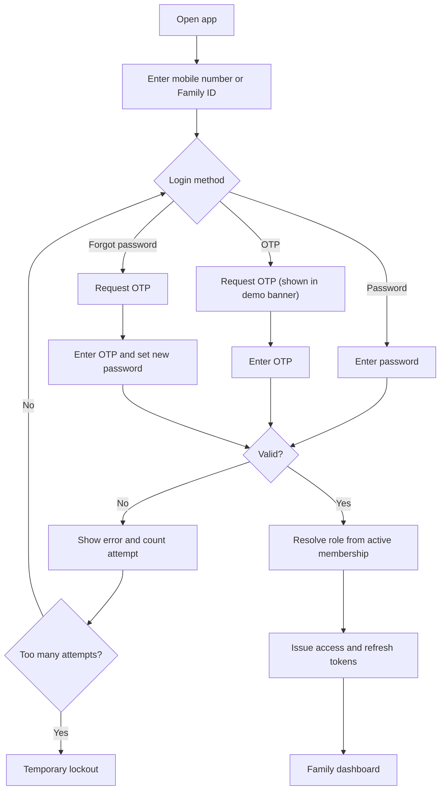
```mermaid
flowchart TD
  A["Open app"] --> B["Enter mobile number or Family ID"]
  B --> C{"Login method"}
  C -- Password --> D["Enter password"]
  C -- OTP --> E["Request OTP (shown in demo banner)"]
  C -- Forgot password --> F["Request OTP"]
  D --> G{"Valid?"}
  E --> H["Enter OTP"]
  F --> I["Enter OTP and set new password"]
  H --> G
  I --> G
  G -- No --> J["Show error and count attempt"]
  J --> K{"Too many attempts?"}
  K -- Yes --> L["Temporary lockout"]
  K -- No --> C
  G -- Yes --> M["Resolve role from active membership"]
  M --> N["Issue access and refresh tokens"]
  N --> O["Family dashboard"]
```

### 10.4 Journey A — Register a family

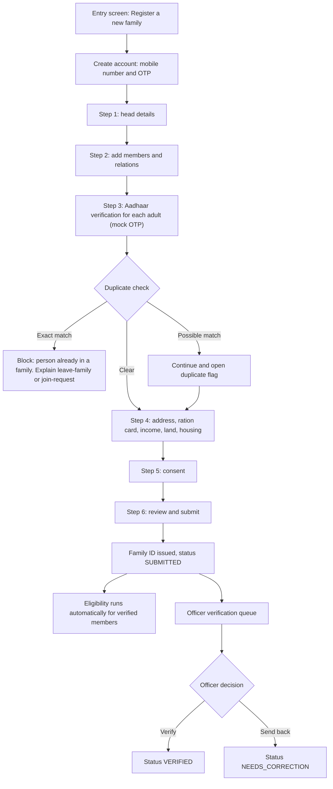
```mermaid
flowchart TD
  A["Entry screen: Register a new family"] --> B["Create account: mobile number and OTP"]
  B --> C["Step 1: head details"]
  C --> D["Step 2: add members and relations"]
  D --> E["Step 3: Aadhaar verification for each adult (mock OTP)"]
  E --> F{"Duplicate check"}
  F -- "Exact match" --> G["Block: person already in a family. Explain leave-family or join-request"]
  F -- "Possible match" --> H["Continue and open duplicate flag"]
  F -- "Clear" --> I["Step 4: address, ration card, income, land, housing"]
  H --> I
  I --> J["Step 5: consent"]
  J --> K["Step 6: review and submit"]
  K --> L["Family ID issued, status SUBMITTED"]
  L --> M["Eligibility runs automatically for verified members"]
  L --> N["Officer verification queue"]
  N --> O{"Officer decision"}
  O -- Verify --> P["Status VERIFIED"]
  O -- Send back --> Q["Status NEEDS_CORRECTION"]
```

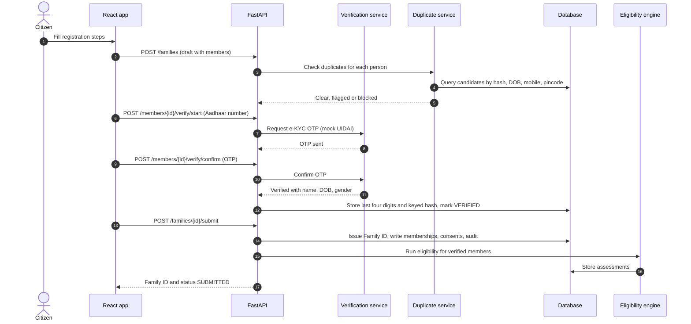
```mermaid
sequenceDiagram
  autonumber
  actor C as Citizen
  participant FE as React app
  participant API as FastAPI
  participant V as Verification service
  participant D as Duplicate service
  participant DB as Database
  participant E as Eligibility engine
  C->>FE: Fill registration steps
  FE->>API: POST /families (draft with members)
  API->>D: Check duplicates for each person
  D->>DB: Query candidates by hash, DOB, mobile, pincode
  D-->>API: Clear, flagged or blocked
  FE->>API: POST /members/{id}/verify/start (Aadhaar number)
  API->>V: Request e-KYC OTP (mock UIDAI)
  V-->>API: OTP sent
  FE->>API: POST /members/{id}/verify/confirm (OTP)
  API->>V: Confirm OTP
  V-->>API: Verified with name, DOB, gender
  API->>DB: Store last four digits and keyed hash, mark VERIFIED
  FE->>API: POST /families/{id}/submit
  API->>DB: Issue Family ID, write memberships, consents, audit
  API->>E: Run eligibility for verified members
  E->>DB: Store assessments
  API-->>FE: Family ID and status SUBMITTED
```

### 10.5 Journey B — View eligible schemes and apply

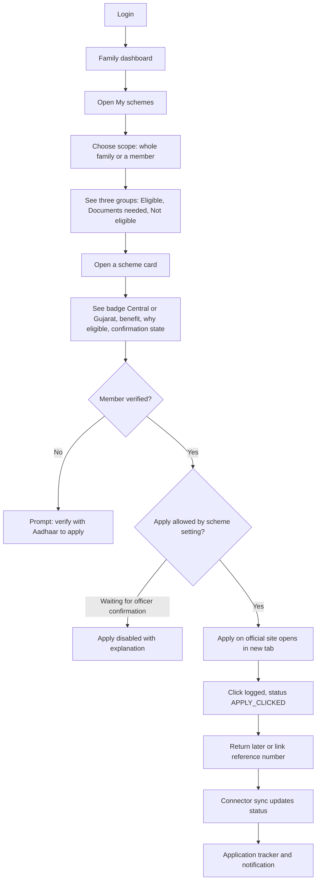
```mermaid
flowchart TD
  A["Login"] --> B["Family dashboard"]
  B --> C["Open My schemes"]
  C --> D["Choose scope: whole family or a member"]
  D --> E["See three groups: Eligible, Documents needed, Not eligible"]
  E --> F["Open a scheme card"]
  F --> G["See badge Central or Gujarat, benefit, why eligible, confirmation state"]
  G --> H{"Member verified?"}
  H -- No --> I["Prompt: verify with Aadhaar to apply"]
  H -- Yes --> J{"Apply allowed by scheme setting?"}
  J -- "Waiting for officer confirmation" --> K["Apply disabled with explanation"]
  J -- Yes --> L["Apply on official site opens in new tab"]
  L --> M["Click logged, status APPLY_CLICKED"]
  M --> N["Return later or link reference number"]
  N --> O["Connector sync updates status"]
  O --> P["Application tracker and notification"]
```

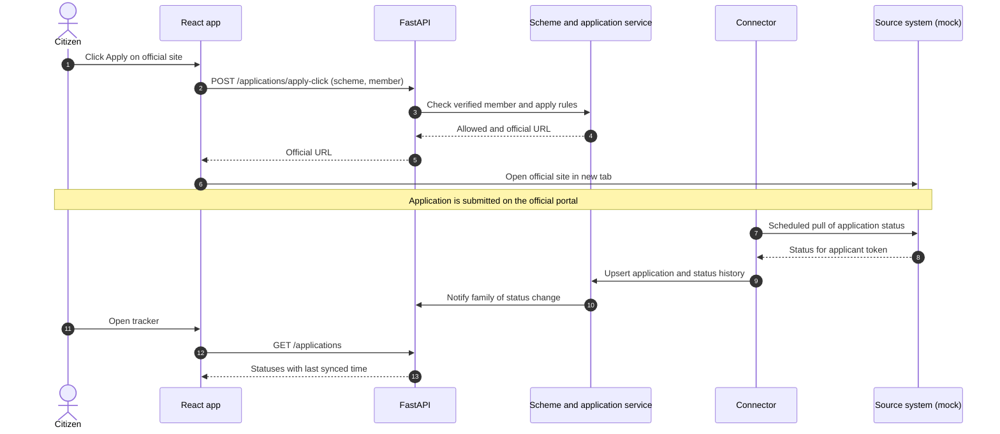
```mermaid
sequenceDiagram
  autonumber
  actor C as Citizen
  participant FE as React app
  participant API as FastAPI
  participant S as Scheme and application service
  participant K as Connector
  participant SRC as Source system (mock)
  C->>FE: Click Apply on official site
  FE->>API: POST /applications/apply-click (scheme, member)
  API->>S: Check verified member and apply rules
  S-->>API: Allowed and official URL
  API-->>FE: Official URL
  FE->>SRC: Open official site in new tab
  Note over C,SRC: Application is submitted on the official portal
  K->>SRC: Scheduled pull of application status
  SRC-->>K: Status for applicant token
  K->>S: Upsert application and status history
  S->>API: Notify family of status change
  C->>FE: Open tracker
  FE->>API: GET /applications
  API-->>FE: Statuses with last synced time
```

### 10.6 Journey C — Split a family

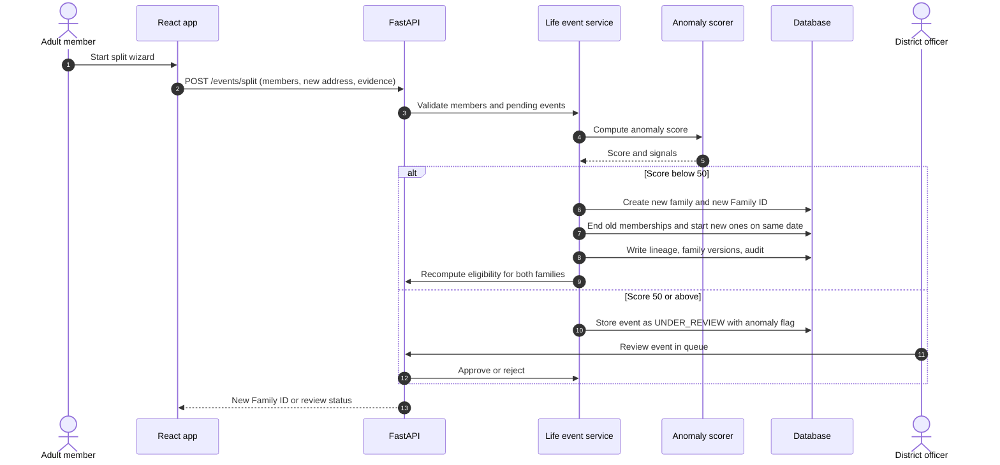
```mermaid
sequenceDiagram
  autonumber
  actor M as Adult member
  participant FE as React app
  participant API as FastAPI
  participant EV as Life event service
  participant AN as Anomaly scorer
  participant DB as Database
  actor O as District officer
  M->>FE: Start split wizard
  FE->>API: POST /events/split (members, new address, evidence)
  API->>EV: Validate members and pending events
  EV->>AN: Compute anomaly score
  AN-->>EV: Score and signals
  alt Score below 50
    EV->>DB: Create new family and new Family ID
    EV->>DB: End old memberships and start new ones on same date
    EV->>DB: Write lineage, family versions, audit
    EV->>API: Recompute eligibility for both families
  else Score 50 or above
    EV->>DB: Store event as UNDER_REVIEW with anomaly flag
    O->>API: Review event in queue
    API->>EV: Approve or reject
  end
  API-->>FE: New Family ID or review status
```

### 10.7 Journey D — Officer reviews a duplicate flag

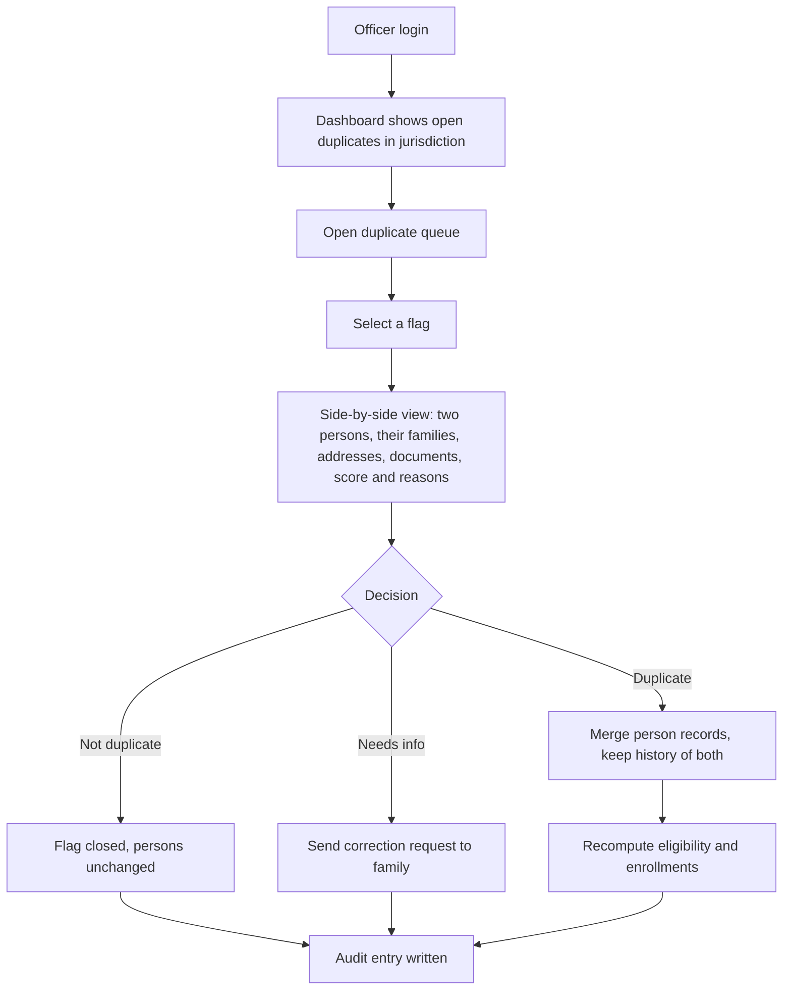
```mermaid
flowchart TD
  A["Officer login"] --> B["Dashboard shows open duplicates in jurisdiction"]
  B --> C["Open duplicate queue"]
  C --> D["Select a flag"]
  D --> E["Side-by-side view: two persons, their families, addresses, documents, score and reasons"]
  E --> F{"Decision"}
  F -- "Not duplicate" --> G["Flag closed, persons unchanged"]
  F -- "Duplicate" --> H["Merge person records, keep history of both"]
  F -- "Needs info" --> I["Send correction request to family"]
  H --> J["Recompute eligibility and enrollments"]
  G --> K["Audit entry written"]
  I --> K
  J --> K
```

### 10.8 Journey E — Citizen views the consent log

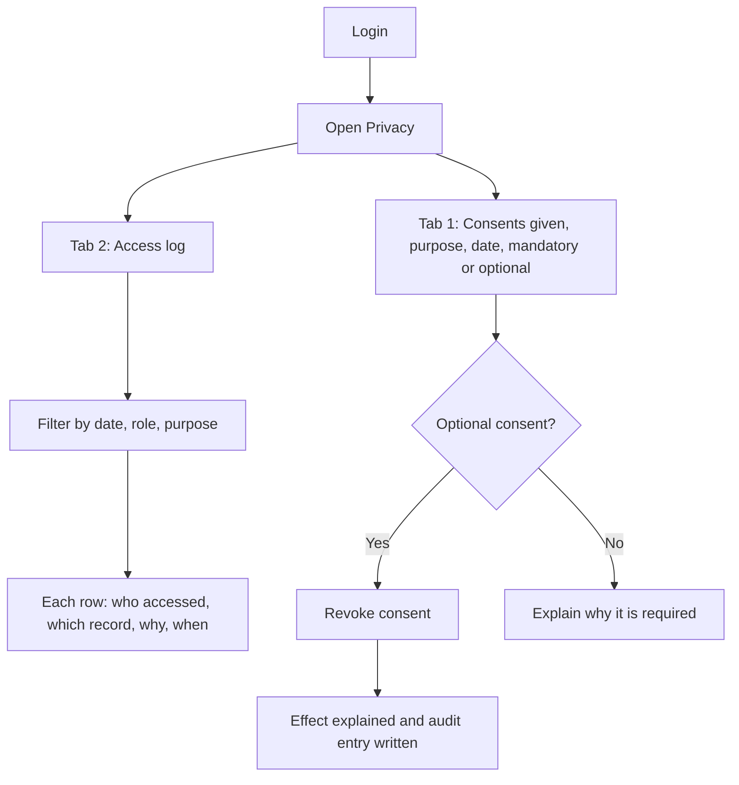
```mermaid
flowchart TD
  A["Login"] --> B["Open Privacy"]
  B --> C["Tab 1: Consents given, purpose, date, mandatory or optional"]
  B --> D["Tab 2: Access log"]
  D --> E["Filter by date, role, purpose"]
  E --> F["Each row: who accessed, which record, why, when"]
  C --> G{"Optional consent?"}
  G -- Yes --> H["Revoke consent"]
  H --> I["Effect explained and audit entry written"]
  G -- No --> J["Explain why it is required"]
```

### 10.9 Design notes for screens

- **Status badges** use the same words everywhere: *Central* or *Gujarat*; *Auto-eligible (awaiting officer)*, *Officer-confirmed*, *Documents needed*, *Not eligible*; and the application statuses.
- Every negative result offers **Why?** with the failing rule and the value used.
- Unverified members show a **Verify with Aadhaar** call to action in place of the Apply button.
- Stale connector data shows **Last synced** with a refresh button.
- Officer tables never show full mobile numbers. Opening a family detail writes a `VIEW` audit entry.

---

## 11. Data flow diagrams

### 11.1 Level 0 — Context diagram

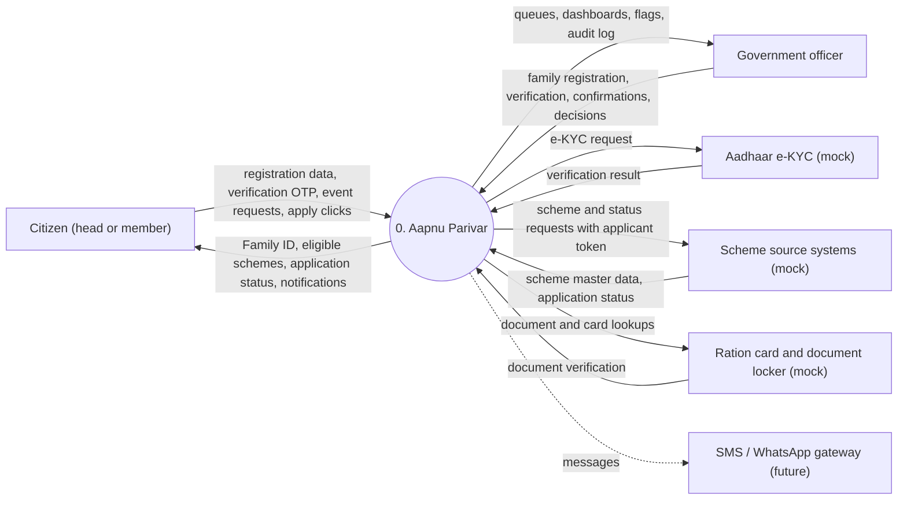
```mermaid
flowchart LR
  CIT["Citizen (head or member)"]
  OFF["Government officer"]
  UID["Aadhaar e-KYC (mock)"]
  SRC["Scheme source systems (mock)"]
  RAT["Ration card and document locker (mock)"]
  MSG["SMS / WhatsApp gateway (future)"]

  P0(("0. Aapnu Parivar"))

  CIT -->|"registration data, verification OTP, event requests, apply clicks"| P0
  P0 -->|"Family ID, eligible schemes, application status, notifications"| CIT
  OFF -->|"family registration, verification, confirmations, decisions"| P0
  P0 -->|"queues, dashboards, flags, audit log"| OFF
  P0 -->|"e-KYC request"| UID
  UID -->|"verification result"| P0
  P0 -->|"scheme and status requests with applicant token"| SRC
  SRC -->|"scheme master data, application status"| P0
  P0 -->|"document and card lookups"| RAT
  RAT -->|"document verification"| P0
  P0 -.->|"messages"| MSG
```

### 11.2 Level 1 — Main processes

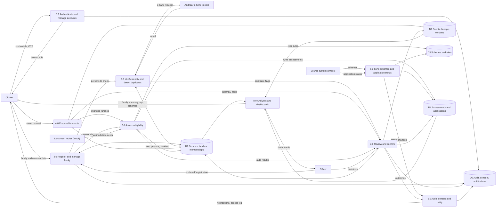
```mermaid
flowchart LR
  CIT["Citizen"]
  OFF["Officer"]
  UID["Aadhaar e-KYC (mock)"]
  SRC["Source systems (mock)"]
  DOC["Document locker (mock)"]

  P1("1.0 Authenticate and manage accounts")
  P2("2.0 Register and manage family")
  P3("3.0 Verify identity and detect duplicates")
  P4("4.0 Process life events")
  P5("5.0 Assess eligibility")
  P6("6.0 Sync schemes and application status")
  P7("7.0 Review and confirm")
  P8("8.0 Analytics and dashboards")
  P9("9.0 Audit, consent and notify")

  D1[("D1 Persons, families, memberships")]
  D2[("D2 Events, lineage, versions")]
  D3[("D3 Schemes and rules")]
  D4[("D4 Assessments and applications")]
  D5[("D5 Audit, consent, notifications")]

  CIT -->|"credentials, OTP"| P1
  P1 -->|"tokens, role"| CIT
  CIT -->|"family and member data"| P2
  OFF -->|"on-behalf registration"| P2
  P2 <--> D1
  P2 -->|"persons to check"| P3
  P3 -->|"e-KYC request"| UID
  UID -->|"result"| P3
  P3 <--> D1
  P3 -->|"duplicate flags"| P7
  CIT -->|"event request"| P4
  P4 <--> D1
  P4 --> D2
  P4 -->|"changed families"| P5
  P4 -->|"anomaly flags"| P7
  P2 -->|"new or changed profile"| P5
  DOC -->|"verified documents"| P5
  P5 -->|"read persons, families"| D1
  P5 -->|"read rules"| D3
  P5 -->|"write assessments"| D4
  P5 -->|"auto results"| P7
  SRC -->|"schemes"| P6
  SRC -->|"application status"| P6
  P6 --> D3
  P6 --> D4
  P6 -->|"status changes"| P9
  OFF -->|"decisions"| P7
  P7 --> D4
  P7 --> D1
  P7 --> D2
  P7 -->|"outcomes"| P9
  D1 --> P8
  D4 --> P8
  D2 --> P8
  P8 -->|"dashboards"| OFF
  P8 -->|"family summary, my schemes"| CIT
  P1 --> D5
  P2 --> D5
  P7 --> D5
  P9 --> D5
  P9 -->|"notifications, access log"| CIT
```

### 11.3 Level 2 — Assess eligibility (process 5.0)

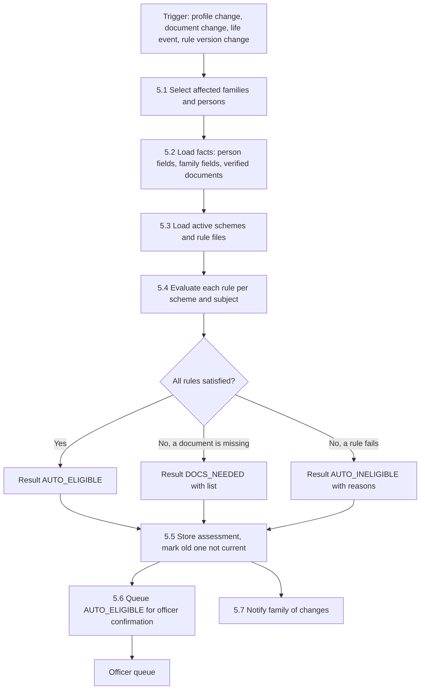
```mermaid
flowchart TD
  T["Trigger: profile change, document change, life event, rule version change"] --> A["5.1 Select affected families and persons"]
  A --> B["5.2 Load facts: person fields, family fields, verified documents"]
  B --> C["5.3 Load active schemes and rule files"]
  C --> D["5.4 Evaluate each rule per scheme and subject"]
  D --> E{"All rules satisfied?"}
  E -- Yes --> F["Result AUTO_ELIGIBLE"]
  E -- "No, a document is missing" --> G["Result DOCS_NEEDED with list"]
  E -- "No, a rule fails" --> H["Result AUTO_INELIGIBLE with reasons"]
  F --> I["5.5 Store assessment, mark old one not current"]
  G --> I
  H --> I
  I --> J["5.6 Queue AUTO_ELIGIBLE for officer confirmation"]
  I --> K["5.7 Notify family of changes"]
  J --> L["Officer queue"]
```

### 11.4 Data stores

| Store | Contents | Written by |
|---|---|---|
| D1 | `person`, `family`, `address`, `family_membership`, `document`, `user_account` | 2.0, 3.0, 4.0, 7.0 |
| D2 | `family_event`, `family_lineage`, `family_version` | 4.0, 7.0 |
| D3 | `scheme`, `scheme_category`, YAML rules | 6.0 (metadata), maintainers (rules) |
| D4 | `eligibility_assessment`, `application`, `application_status_history` | 5.0, 6.0, 7.0 |
| D5 | `audit_log`, `consent_record`, `notification`, `otp_challenge` | all processes |

---

## 12. Eligibility engine and scheme catalog

### 12.1 Rule file format (YAML)

Rules are data, not code. Each scheme references a rule file. Each rule reads a **fact**, applies an **operator** and may require a **verified document**.

```yaml
# rules/pmkisan.yaml   (illustrative, simplified)
scheme_code: PMKISAN
version: "2026.1"
unit: FAMILY
all:
  - id: owns_land
    fact: family.land_holding_acres
    op: gt
    value: 0
    message: "Household must own agricultural land"
    document: LAND_RECORD          # must be VERIFIED
  - id: has_verified_adult
    fact: family.verified_adult_count
    op: gte
    value: 1
    message: "At least one verified adult member is required"
```

```yaml
# rules/post_matric_scholarship.yaml   (illustrative, simplified)
scheme_code: POSTMATRIC_GJ
version: "2026.1"
unit: INDIVIDUAL
all:
  - id: is_student
    fact: person.is_student
    op: eq
    value: true
    message: "Applicant must be a student"
  - id: level
    fact: person.current_course_level
    op: in
    value: [HIGHER_SECONDARY, GRADUATE, POST_GRADUATE, DIPLOMA_ITI]
    message: "Course must be post-matric"
  - id: income
    fact: family.income_band
    op: in
    value: [LT_1L, "1L_2_5L"]
    message: "Family income must be within the limit"
    document: INCOME_CERT
  - id: category
    fact: person.social_category
    op: in
    value: [SC, ST, SEBC, OBC]
    document: CASTE_CERT
    message: "Category must be eligible for this scheme"
  - id: domicile
    fact: person.domicile_gujarat
    op: eq
    value: true
    message: "Applicant must belong to Gujarat"
```

```yaml
# rules/widow_assistance.yaml   (illustrative, simplified)
scheme_code: GANGA_SWARUPA
version: "2026.1"
unit: INDIVIDUAL
all:
  - id: widowed
    fact: person.marital_status
    op: eq
    value: WIDOWED
    message: "Applicant must be a widow"
  - id: adult_woman
    fact: person.gender
    op: eq
    value: FEMALE
    message: "Applicant must be a woman"
  - id: income
    fact: family.income_band
    op: in
    value: [LT_1L, "1L_2_5L"]
    document: INCOME_CERT
    message: "Family income must be within the limit"
  - id: adult
    fact: person.age
    op: gte
    value: 18
    message: "Applicant must be an adult"
```

Supported operators: `eq`, `neq`, `in`, `not_in`, `gt`, `gte`, `lt`, `lte`, `between`, `exists`. Composition: `all`, `any`, `not`. Derived facts (`person.age`, `family.verified_adult_count`, `family.per_capita_income`) are computed by the fact resolver.

### 12.2 Evaluation algorithm

```python
def evaluate(scheme_rules, facts, verified_docs) -> Assessment:
    reasons, missing = [], []
    for rule in flatten(scheme_rules):
        value = resolve(rule.fact, facts)
        passed = OPS[rule.op](value, rule.value)
        if passed and rule.document and rule.document not in verified_docs:
            missing.append(rule.document)
        reasons.append({"rule": rule.id, "passed": passed, "value": value, "message": rule.message})
    if any(not r["passed"] for r in reasons):
        return Assessment("AUTO_INELIGIBLE", reasons, missing)
    if missing:
        return Assessment("DOCS_NEEDED", reasons, missing)
    return Assessment("AUTO_ELIGIBLE", reasons, [])
```

Assessments store the `rule_version` and the values used, so a result can be reproduced and explained later.

### 12.3 Officer confirmation

- `AUTO_ELIGIBLE` results enter the officer's confirmation queue, filtered by the family's district or pincode.
- The officer sees the reasons, the values, and the verified documents, then confirms or rejects with remarks.
- The citizen sees *Auto-eligible (awaiting officer)* until confirmed, then *Officer-confirmed*.
- **Apply gating** is per scheme through `require_officer_confirmation_before_apply` (default `false`). Verified-member status is always required.

### 12.4 Scheme categories and default filters

**Categories:** Health · Education and Scholarships · Agriculture and Farmers · Women and Child · Social Security and Pensions · Food and Nutrition · Housing · Energy and Utilities · Employment and Skills · Financial Inclusion · Disability and Inclusion

**Default filters in the "All schemes" section:**

| Filter | Values |
|---|---|
| Source | Central, Gujarat Government |
| Category | The eleven categories above |
| Department | From catalog |
| Benefit type | Cash, In-kind, Insurance, Subsidy, Loan, Service |
| Applies to | Family, Individual |
| Target group | Women, Girl child, Senior citizen, Farmer, Student, Widow, Person with disability, Artisan, Low-income household |
| My status (when logged in) | Confirmed eligible, Auto-eligible, Documents needed, Not eligible, Applied |
| Sort | Recently updated, Name, Relevance to my family |

### 12.5 Seed scheme catalog

A sample across every category. **Criteria are simplified and illustrative for the demo. Verify each scheme's real rules and links on official sources before any real-world use.**

| Scheme | Source | Category | Unit | Illustrative rule for the demo | Seed apply link |
|---|---|---|---|---|---|
| Ayushman Bharat PM-JAY | Central | Health | Family | Ration card type `AAY` or `PHH`, or low income band | `pmjay.gov.in` |
| Mukhyamantri Amrutum (MA) | Gujarat | Health | Family | Income band at or below a cap | to be verified |
| PM-KISAN | Central | Agriculture and Farmers | Family | Owns land, verified land record | `pmkisan.gov.in` |
| PM Fasal Bima Yojana | Central | Agriculture and Farmers | Individual | Occupation `FARMER` | `pmfby.gov.in` |
| Post Matric Scholarship (Digital Gujarat) | Gujarat | Education and Scholarships | Individual | Student, post-matric, income cap, eligible category | `digitalgujarat.gov.in` |
| PM YASASVI (OBC, EBC, DNT) | Central | Education and Scholarships | Individual | Student, eligible category, income cap | `scholarships.gov.in` |
| Sarasvati Sadhana Yojana | Gujarat | Education and Scholarships | Individual | Female student in the eligible standard | to be verified |
| Vahli Dikri Yojana | Gujarat | Women and Child | Individual | Girl child, income cap, birth-order rule | to be verified |
| Sukanya Samriddhi Yojana | Central | Women and Child | Individual | Girl child under 10 | to be verified |
| Ganga Swarupa assistance | Gujarat | Social Security and Pensions | Individual | Widow, income cap | to be verified |
| National Old Age Pension (NSAP) | Central | Social Security and Pensions | Individual | Age 60 or above, `AAY` or low-income household | `nsap.nic.in` |
| Sant Surdas Yojana | Gujarat | Disability and Inclusion | Individual | Disability percentage at or above a threshold | to be verified |
| NFSA ration (PDS) | Central (state-run) | Food and Nutrition | Family | Ration card type `AAY` or `PHH` | to be verified |
| PM Awas Yojana | Central | Housing | Family | No pucca house, income cap | to be verified |
| PM Ujjwala Yojana | Central | Energy and Utilities | Family | No LPG connection, low-income household | `pmuy.gov.in` |
| PM Vishwakarma | Central | Employment and Skills | Individual | Occupation `ARTISAN` | `pmvishwakarma.gov.in` |
| Manav Garima Yojana | Gujarat | Employment and Skills | Individual | Eligible category, artisan or self-employed, income cap | to be verified |
| PM Jan Dhan Yojana | Central | Financial Inclusion | Individual | No bank account | `pmjdy.gov.in` |

---

## 13. API design

Base path `/api/v1`. JSON over HTTPS. Bearer token authentication. OpenAPI docs served at `/docs`. Officer endpoints apply the jurisdiction filter server-side.

### 13.1 Auth

| Method | Path | Who | Purpose |
|---|---|---|---|
| POST | `/auth/register-account` | Public | Start account creation with mobile and OTP |
| POST | `/auth/login` | Public | Password login |
| POST | `/auth/otp/request` | Public | Request OTP for login, reset or claim |
| POST | `/auth/otp/verify` | Public | Verify OTP and log in |
| POST | `/auth/password/reset` | Public | Set new password after OTP |
| POST | `/auth/refresh` | Authenticated | Refresh token |
| GET | `/auth/me` | Authenticated | Current user, role, jurisdiction |

### 13.2 Family and members

| Method | Path | Who | Purpose |
|---|---|---|---|
| GET | `/lookup/family/{family_id}` | Public | Validate ID format and check digit, return existence only |
| POST | `/families` | Citizen, officer | Create draft family with members |
| POST | `/families/{id}/submit` | Head, officer | Submit, issue Family ID |
| GET | `/families/me` | Citizen | My family with members |
| GET | `/families/{id}` | Officer | Family detail within jurisdiction |
| PATCH | `/families/{id}` | Head, officer | Update fields (sensitive changes go to review) |
| POST | `/families/{id}/members` | Head, officer | Add member with duplicate check |
| POST | `/families/{id}/head` | Head, officer | Change head |
| GET | `/families/{id}/history` | Family, officer | Memberships, versions, lineage |
| GET | `/families/{id}/as-of` | Officer | Composition at a date |
| POST | `/families/{id}/join-requests` | Citizen | Request to join a family |
| POST | `/members/{id}/verify/start` | Family, officer | Begin Aadhaar e-KYC (mock) |
| POST | `/members/{id}/verify/confirm` | Family, officer | Confirm OTP |
| POST | `/members/{id}/documents` | Family, officer | Add document (mock upload) |

### 13.3 Life events

| Method | Path | Who | Purpose |
|---|---|---|---|
| POST | `/events/birth`, `/events/death`, `/events/marriage`, `/events/split`, `/events/merge`, `/events/migration`, `/events/income-change` | Family, officer | Create an event |
| GET | `/events` | Family, officer | List events |
| GET | `/events/{id}` | Family, officer | Detail with anomaly signals |
| POST | `/events/{id}/decision` | District officer | Approve or reject |
| POST | `/events/split/preview` | Family | Preview effects and anomaly score before submit |

### 13.4 Schemes, eligibility and applications

| Method | Path | Who | Purpose |
|---|---|---|---|
| GET | `/schemes` | Authenticated | Catalog with filters and search |
| GET | `/schemes/{code}` | Authenticated | Detail |
| GET | `/schemes/categories` | Authenticated | Categories |
| GET | `/eligibility/mine` | Citizen | Assessments for my family and members |
| GET | `/eligibility/{assessment_id}/explain` | Family, officer | Rule-by-rule reasons |
| POST | `/eligibility/recompute` | Officer | Recompute for a family |
| GET | `/officer/eligibility-queue` | Officer | Pending confirmations |
| POST | `/officer/eligibility/{id}/decision` | Officer | Confirm or reject |
| POST | `/applications/apply-click` | Verified member | Log click, return official URL |
| POST | `/applications/link` | Verified member | Link an existing reference number |
| GET | `/applications` | Family | Tracker |
| GET | `/applications/{id}/history` | Family | Timeline |
| POST | `/connectors/sync` | Admin, scheduler | Trigger sync |
| GET | `/connectors/health` | Admin | Connector status |

### 13.5 Officer, dashboard and governance

| Method | Path | Who | Purpose |
|---|---|---|---|
| GET | `/admin/dashboard/summary` | Officer | KPIs with district, taluka, pincode filters |
| GET | `/admin/dashboard/charts` | Officer | Chart datasets |
| GET | `/admin/families` | Officer | Search and filter |
| POST | `/admin/families` | Officer | Register on behalf |
| GET | `/admin/queues/{type}` | Officer | `verification`, `duplicates`, `events`, `corrections` |
| POST | `/admin/families/{id}/verify` | Officer | Verify or send back |
| POST | `/admin/duplicates/{id}/decision` | District officer | Resolve duplicate flag |
| GET | `/admin/export/families.csv` | Officer | CSV of filtered list |
| POST | `/corrections` | Family | Create correction request |
| GET | `/corrections` | Family, officer | List |
| POST | `/corrections/{id}/decision` | Officer | Approve or reject |
| GET | `/privacy/consents` | Citizen | My consents |
| POST | `/privacy/consents/{id}/revoke` | Citizen | Revoke optional consent |
| GET | `/privacy/access-log` | Citizen | Who accessed my family data |
| GET | `/admin/audit` | Officer, auditor | Audit log within scope |
| GET | `/notifications` | Authenticated | In-app notifications |
| POST | `/assistant/ask` | Citizen | Chatbot stub |
| GET | `/health` | Public | Health check |

---

## 14. Security and privacy design

### 14.1 Principles

Privacy by design, least privilege, data minimisation, purpose limitation, and full auditability. The design follows the principles of the Digital Personal Data Protection Act, 2023 and the restrictions around handling Aadhaar numbers. Real deployment needs legal review. The demo uses synthetic data only.

### 14.2 Controls

| Area | Control |
|---|---|
| Authentication | Argon2 password hashing. OTP with expiry (5 minutes), single use, attempt limit. Short-lived JWT access token (15 minutes) and refresh token with rotation |
| Authorisation | Role-based access on every endpoint. **Jurisdiction filter** (district or pincode) applied in the data-access layer for officers. Citizens can only reach their own family through the active membership |
| Aadhaar handling | Never stored in full. Keyed HMAC hash for matching, last four digits for display. In production, tokenise through an Aadhaar data vault |
| Field protection | Mask mobile, ration card and income in list views. Encrypt sensitive columns at rest in production. Secrets only in environment variables |
| Transport | HTTPS on hosted deployment. Strict CORS allow-list. Secure headers |
| Input handling | Pydantic validation, parameterised queries through SQLAlchemy, output encoding in React, file type and size checks for uploads |
| Abuse prevention | Rate limiting on login, OTP and lookup. The public Family ID lookup returns existence only, with no personal data |
| Auditability | Append-only `audit_log` for writes and for every officer read (`VIEW`) with purpose. Optional hash chaining of rows for tamper evidence |
| Consent | Consent records per purpose. Citizens can see the access log. Optional consents can be revoked |
| Logging | Structured logs with request IDs. No personal data in logs |
| Dependencies | Pinned versions and automated vulnerability checks in the repository |
| Backups | Daily backups of the hosted database, with restore tested (design) |

### 14.3 Threats and mitigations

| Threat | Mitigation |
|---|---|
| Enumeration of Family IDs | Non-sequential serials, existence-only lookup, rate limiting |
| Officer viewing data outside their area | Server-side jurisdiction filter and audit of every view |
| Insider misuse | Purpose recorded on reads, access log visible to the citizen, anomaly review on audit data (future) |
| Fake families or artificial splits | Aadhaar verification, duplicate detection, anomaly scoring, officer review |
| Account takeover | Lockout, OTP, refresh-token rotation, notification on sensitive changes |
| Data leakage through exports | CSV export restricted to jurisdiction, masked fields, logged |
| Stale or wrong source data | Show `last_synced_at`, allow correction requests, never overwrite source outcomes silently |

### 14.4 Data protection rights (design)

- **Access:** citizens see their family data and who accessed it.
- **Correction:** correction request workflow (CORR).
- **Withdrawal of consent:** optional consents can be revoked. Mandatory ones are explained.
- **Retention:** retention periods per data class are a policy decision (Section 22).

---

## 15. Synthetic data plan

**Goal:** about **10,000 members** in roughly **2,400 families** across **all Gujarat districts**, generated reproducibly with a fixed random seed.

### 15.1 Generators

| Item | Approach |
|---|---|
| Names | Gujarati first-name and surname lists (for example Patel, Shah, Desai, Parmar, Solanki, Vaghela, Chaudhary, Rathod, Makwana, Bhatt) with English transliteration. Faker for supporting fields |
| Districts and pincodes | District master (all districts). Synthetic pincode master with realistic prefixes per region (`36xxxx` to `39xxxx`). Districts are weighted by approximate population so dashboards look realistic |
| Family size | Mean about 4.2 members. Mix of nuclear, joint and single-member households |
| Composition | Head, spouse, children, and some elderly parents. Ages and relations kept consistent (parents older than children, spouse age gap plausible) |
| Income and land | Income bands skewed by district type. Land only for some rural households |
| Aadhaar | Synthetic 12-digit numbers starting with `1` (never valid for real people), with a valid Verhoeff check digit. Stored only as hash and last four digits |
| Verification | About 80% of adults `VERIFIED`, the rest `UNVERIFIED` so that the "verify to unlock" flow is visible |
| Documents | Verified documents attached to a realistic share of members so some assessments are `AUTO_ELIGIBLE` and some `DOCS_NEEDED` |
| Applications | About a third of families have at least one application in varied statuses, produced by the mock connectors |
| Family IDs | Generated with the same code as production (Section 7) |

### 15.2 Injected scenarios for the demo

| Scenario | Count (approx.) | Shows |
|---|---|---|
| Near-duplicate persons (typos, transliteration variants, different address) | 60 pairs | Duplicate queue |
| Suspicious splits (same address, recent application) | 25 | Anomaly panel |
| Pending events (birth, death, marriage, migration, income change) | 100 | Event queue |
| Families in `SUBMITTED` awaiting verification | 150 | Verification queue |
| Auto-eligible awaiting confirmation | 400 | Eligibility queue |
| Historic splits with lineage | 40 | Family history and lineage view |
| Officers | 1 state admin, 1 district officer per district, a few field officers with pincode scope | Role and jurisdiction demo |

### 15.3 Demo accounts (synthetic, demo only)

| Role | Login | Notes |
|---|---|---|
| Family head | a seeded mobile number with a shown demo password | Family with two adult sons, ready for the split demo |
| Family member | a second seeded mobile in the same family | Shows shared access |
| District officer | `ahmedabad.officer@demo.example` | Scope: one district |
| Field officer | `fieldofficer.380001@demo.example` | Scope: a pincode list |
| State admin | `stateadmin@demo.example` | Scope: all Gujarat |

Demo passwords appear only in the README and are never reused.

### 15.4 Scheme and connector fixtures

- `fixtures/schemes.json` holds the catalog in Section 12.5.
- Each mock connector reads a fixture and produces application statuses from a seeded random process, with realistic transitions over time.
- A `--reset` flag rebuilds the database so the demo can be repeated.

---

## 16. Tech stack, deployment and repository

### 16.1 Stack

| Layer | Choice | Why |
|---|---|---|
| Frontend | **React** with Vite, React Router, TanStack Query | Fast build, simple data fetching |
| UI | Tailwind CSS with accessible components | Quick, consistent styling |
| Charts | **Plotly** (`plotly.js` basic bundle through `react-plotly.js`) | Requested. Rich dashboard charts |
| i18n | `react-i18next` scaffold with English strings only | Gujarati can be added without refactoring |
| Backend | **FastAPI**, Uvicorn, Pydantic v2 | Typed, fast, automatic OpenAPI |
| ORM and migrations | SQLAlchemy 2 and Alembic | One codebase for SQLite and PostgreSQL |
| Database | SQLite locally, free managed PostgreSQL when hosted | Free and portable |
| Auth | Argon2 (`argon2-cffi`), JWT (`PyJWT`) | Standard and simple |
| Matching | **rapidfuzz** | Fast fuzzy name and address matching |
| Rules | **PyYAML** loader and a small rule evaluator | Rules as data |
| Scheduling | APScheduler | Connector sync jobs without extra infrastructure |
| Data generation | Faker plus custom Gujarati name lists | Realistic synthetic data |
| Testing | pytest, httpx, Vitest and React Testing Library | Unit and API tests |
| Quality | Ruff, Black, ESLint, Prettier, pre-commit | Consistency |
| Docs | Mermaid in Markdown | Renders on GitHub |

### 16.2 Configuration

| Variable | Purpose |
|---|---|
| `DATABASE_URL` | `sqlite:///./aapnu.db` locally, PostgreSQL URL when hosted |
| `JWT_SECRET`, `AADHAAR_HASH_KEY` | Signing and hashing secrets |
| `ALLOWED_ORIGINS` | CORS allow-list |
| `DEMO_MODE` | Shows OTPs in a banner and enables demo accounts |
| `SYNC_INTERVAL_MINUTES` | Connector schedule |
| `VITE_API_URL` | Frontend API base URL |

### 16.3 Repository structure

```
aapnu-parivar/
├── README.md                     # overview, screenshots, run steps, demo accounts
├── docs/
│   ├── DESIGN.md                 # this document
│   └── images/
├── backend/
│   ├── app/
│   │   ├── main.py
│   │   ├── core/                 # config, security, deps, jurisdiction filter
│   │   ├── models/               # SQLAlchemy models
│   │   ├── schemas/              # Pydantic schemas
│   │   ├── api/v1/               # routers: auth, families, events, schemes, admin ...
│   │   ├── services/             # family, membership, events, verification, duplicates,
│   │   │                         # eligibility, applications, audit, notifications, analytics
│   │   ├── connectors/           # base.py and mock_* connectors
│   │   ├── rules/                # YAML eligibility rules
│   │   └── utils/                # family_id.py (Verhoeff), masking, normalisation
│   ├── seed/                     # generators, fixtures, seed.py
│   ├── migrations/
│   └── tests/
├── frontend/
│   ├── src/
│   │   ├── pages/ (citizen, admin)
│   │   ├── components/
│   │   ├── api/
│   │   ├── i18n/
│   │   └── main.tsx
│   └── tests/
├── docker-compose.yml            # optional: api, web, postgres
└── .github/workflows/ci.yml      # lint and tests
```

### 16.4 Run steps (to be included in the README)

```bash
# backend
cd backend && python -m venv .venv && source .venv/bin/activate
pip install -r requirements.txt
python -m seed.seed --reset            # creates ~10,000 synthetic members
uvicorn app.main:app --reload

# frontend
cd frontend && npm install && npm run dev
```

### 16.5 Hosting plan (free)

| Part | Option |
|---|---|
| Frontend | Static hosting on Vercel, Netlify or Cloudflare Pages |
| Backend | Free web service (for example Render). May sleep when idle |
| Database | Free managed PostgreSQL (for example Neon or Supabase) |
| Fallback | Run locally and rely on the recorded video |

Confirm current free-tier limits before the demo date. The seeded 10,000-member dataset is small, so it should fit comfortably, but verify.

---

## 17. Testing plan

| Level | What | Examples |
|---|---|---|
| Unit | Family ID, rules engine, duplicate scoring, membership invariants | Verhoeff accepts valid IDs and rejects single-digit errors and adjacent transpositions. Rule operators. Score thresholds |
| Database | Constraints | Inserting a second active membership for a person fails. Two active heads fail |
| API | Endpoints, roles, jurisdiction | Officer in district A cannot read a family in district B. Citizen cannot read another family |
| Flow | End-to-end journeys | Register, verify, submit, eligibility, officer confirm. Split with new Family ID, lineage and recomputed eligibility |
| Security | Authentication and abuse cases | Lockout after repeated failures. OTP reuse rejected. Existence-only lookup leaks nothing |
| UI | Key screens | Filters on All schemes, status badges, unverified member cannot apply |
| Performance | Dashboard and eligibility timing | Filtered dashboard under 2 s with 10,000 members |

### 17.1 Acceptance checklist mapped to the demo

| # | Check | Requirements |
|---|---|---|
| 1 | Register a family, verify adults, receive a valid Family ID | REG, VER |
| 2 | Adding an already-registered person is blocked | DUP-01, DUP-02 |
| 3 | Unverified member cannot apply | VER-03 |
| 4 | Eligible, Documents needed and Not eligible groups appear with reasons | ELG-03, ELG-08 |
| 5 | Officer confirms eligibility and the citizen sees the change | ELG-05, ELG-06 |
| 6 | Apply opens the official link and the click is logged | APP-01 |
| 7 | Tracker shows statuses with last-synced time | APP-02, SCH-07 |
| 8 | Split creates a new Family ID, keeps history and lineage | EVT-04, HIST |
| 9 | Both families' eligibility recomputes after the split | BR-S7 |
| 10 | Officer dashboard filters by district and pincode | ADM-02, ADM-07 |
| 11 | Citizen sees who accessed the family data | CON-03 |

---

## 18. Build plan and prioritisation

### 18.1 Reality check

The full specification above is larger than a solo 6-hour build, even with AI assistance. The strategy is therefore:

1. **Build one thin vertical slice first**, end to end, then widen it.
2. **Everything marked P0 is the demo.** P1 is added only after the P0 slice works. P2 remains documentation and stubs.
3. **Keep the document and the UI honest.** Screens for P2 items are visibly marked *Coming soon* or *Demo stub*.

### 18.2 Suggested time plan (about 6 hours)

| Time | Work | Output |
|---|---|---|
| 0:00–0:30 | Repository, backend and frontend skeletons, models for person, family, membership, scheme | App boots. Database creates |
| 0:30–1:30 | Auth (password and mock OTP), Family ID generator, registration API, one-active-membership constraint, mock Aadhaar verification | Register and verify through API |
| 1:30–2:30 | Duplicate check, life events framework with **split**, **birth**, **death**, history and lineage | Split works with new Family ID |
| 2:30–3:30 | Scheme catalog, mock connectors, YAML rules engine, assessments, officer confirmation | Eligibility groups and confirmation |
| 3:30–5:00 | React citizen app: entry, login, register stepper, dashboard, members, My schemes, All schemes, tracker, split wizard, privacy log | Citizen demo complete |
| 5:00–5:40 | Officer dashboard: KPIs, Plotly charts, district and pincode filters, verification and eligibility queues | Officer demo complete |
| 5:40–6:00 | Seed to 10,000 members, README, screenshots, record video | Submission ready |

### 18.3 Cut lines (drop in this order if behind)

1. Officer duplicate resolution UI (keep flag creation)
2. Marriage, merge, migration and income-change flows (keep birth, death, split)
3. Correction request form
4. CSV export and audit viewer
5. Anomaly scoring UI (keep the score in the API)
6. Notifications (keep OTP banner)
7. Charts beyond three (keep families by district, verification status, eligible-not-applied gap)

**Never cut:** Family ID, verification gate, one-active-family rule, eligibility with officer confirmation, split with history, district filter.

### 18.4 Definition of done

- All acceptance checks in 17.1 pass on the seeded dataset.
- Repository has a clear README, run steps, screenshots and this document.
- A video demonstrates the full story in 5 to 7 minutes.

---

## 19. Demo and video plan

### 19.1 Video script (about 6 minutes)

| Time | Scene | Shows |
|---|---|---|
| 0:00–0:30 | Problem and idea | Fragmented lists, repeated documents, the Family ID answer |
| 0:30–1:30 | **Register a family** | Stepper, Aadhaar (mock) verification, duplicate block, Family ID issued |
| 1:30–2:30 | **My schemes** | Eligible, Documents needed, Not eligible, badges (Central or Gujarat), "Why?" |
| 2:30–3:15 | **Apply and track** | Official link, tracker with statuses and last-synced time. Verified-only rule |
| 3:15–4:15 | **Split a family** | Adult son forms a new household, new Family ID, lineage, both families' eligibility change |
| 4:15–5:15 | **Officer view** | District and pincode filters, verification and eligibility confirmation, duplicate flag |
| 5:15–5:45 | **Privacy** | Consent and access log |
| 5:45–6:00 | Roadmap | Gujarati, SMS and WhatsApp, chatbot, real integrations |

### 19.2 Submission checklist

- [ ] Public GitHub repository with README, `docs/DESIGN.md`, screenshots
- [ ] `requirements.txt`, `package.json`, `.env.example`
- [ ] Seed script and one-command reset
- [ ] CI badge (lint and tests)
- [ ] Hosted link (optional) and the video link in the README
- [ ] Clear statement that all data is synthetic and scheme rules are illustrative

### 19.3 Talking points for judges

- One ID per family with **history**, not just a number.
- **Verified members only** can apply, and a **human confirms** eligibility.
- **Connectors** mean the platform reads from original systems and never becomes a second source of truth.
- **Privacy by design:** consent, access log, no full Aadhaar stored.
- Real family change (split, marriage, death) is handled and auditable.

---

## 20. Risks and mitigations

| Risk | Impact | Mitigation |
|---|---|---|
| Scope too large for the build window | Incomplete demo | P0 slice first and cut lines (18.3) |
| Free hosting sleeps or limits | Slow or unavailable live demo | Local run and recorded video as fallback |
| Scheme rules are simplified | Misleading results if taken as real | Label as illustrative in UI, README and this document |
| Real Aadhaar rules are strict | Non-compliance if productionised | Mock only. Design for data vault and licensed authentication |
| Synthetic data looks fake | Weak demo | Realistic distributions and injected scenarios |
| Complexity of fuzzy matching | False positives | Officer review for the middle band, tuned thresholds |
| Family definition differs by scheme | Wrong eligibility unit | `eligibility_unit` per scheme and configurable rules |
| Source systems not available in reality | Integration gap | Connector abstraction and clear roadmap |

---

## 21. Future scope and roadmap

### 21.1 Roadmap

| Phase | Items |
|---|---|
| **Phase 1 (this project)** | English web app, synthetic data, mock connectors, core flows, officer dashboard |
| **Phase 2** | **Gujarati UI** (i18n, name transliteration), SMS and WhatsApp notifications, full duplicate resolution, correction workflow, PWA with **offline mode** for field workers |
| **Phase 3** | Real integrations (Aadhaar authentication through licensed channels, ration card database, document locker, scheme portals through a national or state API exchange, DBT), consent manager |
| **Phase 4** | **Aapnu Sahayak** chatbot in Gujarati and English, ML anomaly detection and duplicate similarity, benefit-gap analytics and policy simulation |
| **Phase 5** | Statewide scale: microservices, gateway, event streaming, search cluster, multi-zone deployment |

### 21.2 Future architecture

```mermaid
flowchart TB
  subgraph EDGE["Edge"]
    WEB["Web and PWA (Gujarati and English)"]
    MOB["Mobile app"]
    KIOSK["Field officer offline app"]
  end

  GW["API gateway: authentication, rate limits, routing"]

  subgraph SVC["Services"]
    IDS["Identity and family service"]
    EVS["Life event service"]
    ELS["Eligibility service"]
    CNS["Connector service"]
    NTS["Notification service"]
    CMS["Consent manager"]
    ANS["Analytics service"]
    AIS["AI service: chatbot, anomaly, matching"]
  end

  BUS[["Message queue / event stream"]]

  subgraph DATA["Data"]
    PG[("PostgreSQL, partitioned by district")]
    SRCH[("Search index")]
    CACHE[("Cache")]
    VAULT[("Aadhaar data vault")]
    WH[("Analytics warehouse")]
    OBJ[("Encrypted document store")]
  end

  subgraph EXT["External systems"]
    AUTH["Aadhaar authentication"]
    RAT["Ration card and NFSA"]
    DLK["Document locker"]
    PORT["Scheme portals and DBT"]
    MSG["SMS and WhatsApp providers"]
  end

  WEB --> GW
  MOB --> GW
  KIOSK --> GW
  GW --> IDS
  GW --> EVS
  GW --> ELS
  GW --> ANS
  GW --> AIS
  IDS --> BUS
  EVS --> BUS
  BUS --> ELS
  BUS --> NTS
  BUS --> ANS
  ELS --> CNS
  IDS --> CMS
  CNS --> AUTH
  CNS --> RAT
  CNS --> DLK
  CNS --> PORT
  NTS --> MSG
  IDS --> PG
  EVS --> PG
  ELS --> PG
  IDS --> VAULT
  IDS --> SRCH
  IDS --> CACHE
  ANS --> WH
  IDS --> OBJ
```

### 21.3 Gujarati support plan

- All UI strings go through `react-i18next` from day one. Adding `gu` is a translation task.
- Store `full_name_local` alongside the English name.
- Use transliteration-aware normalisation in duplicate matching so Gujarati and English spellings of the same name score as similar.
- Test with Gujarati fonts and longer strings.

### 21.4 Notification channels

The notification service already separates *what to say* from *how to deliver it*. Adding SMS or WhatsApp means adding a channel adapter and templates, subject to provider approvals and consent.

### 21.5 Offline mode for field workers

Progressive web app with local storage of drafts, background sync when connectivity returns, conflict handling (server wins on verified fields), and encrypted local storage.

### 21.6 AI roadmap

| Feature | MVP stub | Future |
|---|---|---|
| Aapnu Sahayak | Rule-based answers over catalog and eligibility | LLM with retrieval over scheme documents, Gujarati voice and text, guardrails and citations |
| Split anomaly | Rule-based score (8.6) | Model trained on reviewed cases with explanations |
| Duplicate matching | Weighted fuzzy score | Learned matcher with active learning from officer decisions |
| Gap analytics | Counts of eligible but not applied | Outreach targeting by district and pincode |

---

## 22. Assumptions and open decisions

| # | Topic | Current assumption | To decide |
|---|---|---|---|
| 1 | Definition of family | Household sharing a residence and ration card, headed by one verified adult | Official definition and treatment of joint families |
| 2 | When adult children split | On request, with evidence. No automatic split at 18 | Minimum age or independence criteria per scheme |
| 3 | Apply gating | Verified member required. Officer confirmation optional per scheme | Should confirmation always precede apply |
| 4 | Aadhaar use | Mock e-KYC, hash and last four digits | Legal basis, licensed authentication route, data vault |
| 5 | Minor verification | Guardian-assisted (P1) | Official approach for children without Aadhaar |
| 6 | Income data | Self-declared band plus a document | Authoritative income source and refresh cycle |
| 7 | Family ID and ration card | Independent ID, ration card number stored as an attribute | Whether the Family ID replaces or maps to the ration card |
| 8 | Migration outside Gujarat | Portability request reviewed by an officer | Inter-state protocol |
| 9 | Retention | Keep history indefinitely in the demo | Retention periods per data class |
| 10 | District codes | Internal 01–99 codes | Map to official LGD codes and handle new districts |
| 11 | Scheme rules | Simplified and illustrative | Source of truth and update process for rules |
| 12 | Language | English now | Gujarati rollout and translation ownership |

---

*End of document.*
