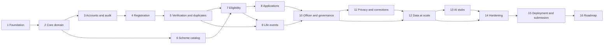

# Aapnu Parivar — Implementation Plan

> Phase-by-phase build plan for the design in `docs/DESIGN.md`. Phases are ordered by **dependency**, not by time. Each phase is a **vertical slice** (backend + frontend + data + tests), so the app is runnable and demoable after every phase.

---

## 0. How to use this plan

### 0.1 Principles

1. **Vertical slices.** Every phase ends with something a person can click through, not just an API.
2. **Core first, extended second.** Each phase splits work into **Core (P0)** and **Extended (P1)**. Finish all Core parts of a phase before touching Extended parts, and finish Core parts across phases before Extended parts anywhere.
3. **Database enforces the rules.** Invariants such as one active family per person live in constraints, with service logic on top.
4. **Contract first.** Define request and response schemas (Pydantic), let FastAPI publish OpenAPI, and generate TypeScript types from it so the frontend cannot drift.
5. **Seed as you go.** Every phase adds its part to the seed script, so there is always realistic data to demo. Phase 12 scales it up.
6. **Everything is synthetic.** No real citizen data, no real Aadhaar numbers, and scheme rules are labelled illustrative.
7. **Feature flags for Extended work.** P1 features sit behind environment flags so an unfinished feature never breaks the demo.

### 0.2 Phase map

| # | Phase | Outcome |
|---|---|---|
| 1 | Foundation and scaffolding | Empty stack runs, CI green |
| 2 | Core domain and reference data | Schema, constraints, Family ID, reference data |
| 3 | Accounts, roles and audit | Login, RBAC, jurisdiction filter, audit |
| 4 | Family registration and membership | Register a family and receive a Family ID |
| 5 | Verification and duplicate detection | Aadhaar (mock) verification, one person one family |
| 6 | Scheme catalog and connectors | All-schemes explorer with filters |
| 7 | Documents, eligibility and officer confirmation | Automatic eligibility with human confirmation |
| 8 | Applications, tracking and notifications | Apply on official site and track status |
| 9 | Life events and history | Split, birth, death and the rest, with full history |
| 10 | Officer and governance | District and pincode dashboard and review queues |
| 11 | Citizen privacy, corrections and settings | Consent and access log, correction requests |
| 12 | Synthetic data at scale | About 10,000 members with demo scenarios |
| 13 | AI stubs and advanced features | Chatbot stub and anomaly panel |
| 14 | Quality, security and hardening | Test suite, RBAC matrix, performance, accessibility |
| 15 | Deployment, documentation and submission | Hosted link, README, video, repository ready |
| 16 | Post-submission roadmap | Gujarati, SMS and WhatsApp, offline, real integrations |

### 0.3 Dependency graph



**Critical path:** 1 → 2 → 3 → 4 → 5 → 7 → 8 → 9 → 10 → 12 → 14 → 15. Phase 6 can be done any time after Phase 2 and before Phase 7.

### 0.4 Milestones (demoable checkpoints)

| Milestone | After phase | What you can demo |
|---|---|---|
| **M1: Identity** | 5 | Register a family, verify members, get a Family ID, duplicate blocked |
| **M2: Benefits** | 8 | See eligible schemes, officer confirms, apply and track |
| **M3: Change** | 9 | Split a family with history and recomputed eligibility |
| **M4: Governance** | 10 | Officer dashboard with district and pincode filters and review queues |
| **M5: Scale** | 12 | Everything on about 10,000 synthetic members |
| **M6: Submission** | 15 | Hosted app, README, video |

If you must stop early, stop at the highest milestone you have fully finished.

### 0.5 Requirement coverage

| Requirement group | Built in phase |
|---|---|
| SYS | 1, 12 |
| AUTH | 3 |
| REG | 4 |
| FAM | 4 (Core), 4 Extended |
| VER | 5 |
| DUP | 5 (Core), 10 (officer resolution) |
| SCH | 6 |
| ELG | 7 |
| APP | 8 |
| NOT | 8 (in-app), 11 (UI) |
| EVT and HIST | 9 |
| ADM | 10 |
| CON | 3 (audit), 4 (consent capture), 11 (access log UI) |
| CORR | 11 |
| AI | 13 |
| CDASH | Spread across 4, 7, 8, 9, 11 |

### 0.6 Working method with an AI assistant

For each task, give the assistant: the relevant design section, the exact files to create or change, the constraints (for example "no full Aadhaar stored"), and the tests to write. Ask for one small unit at a time and run tests before moving on.

Template:

```
Context: docs/DESIGN.md section <N> (paste the section).
Task: <one concrete unit, for example "implement split_family service">.
Files: <paths to create or edit>.
Constraints: <rules from the doc, for example BR-M1, BR-M3>.
Tests: <cases to cover>.
Output: code and tests only, no explanation.
```

### 0.7 Repository workflow

- One branch per phase: `phase/03-accounts-roles-audit`.
- Small commits with clear messages (`feat: add jurisdiction filter`).
- Merge to `main` only when the phase's exit criteria pass.
- Tag each finished phase: `phase-3-done`. Tag milestones: `m1-identity`.
- Keep `main` always runnable.

### 0.8 Definition of done for every phase

- [ ] Core tasks complete. Extended tasks either complete behind a flag or listed as deferred
- [ ] New code has tests, and the full suite passes
- [ ] Lint and formatting pass, and CI is green
- [ ] Migrations apply cleanly on a fresh SQLite database
- [ ] Seed script includes this phase's data
- [ ] OpenAPI is up to date and frontend types regenerated
- [ ] The phase's exit criteria are demonstrated in the browser
- [ ] `docs/DESIGN.md` is updated if the build deviated from the design

---

## Phase 1 — Foundation and scaffolding

**Goal:** an empty but complete stack that runs locally and in CI.
**Depends on:** nothing.
**Covers:** SYS-01, SYS-03, SYS-04.

### Backend — Core
- [ ] Create the repository layout from Design Section 16.3
- [ ] `backend/app/main.py` with FastAPI app, versioned router prefix `/api/v1`, CORS from `ALLOWED_ORIGINS`
- [ ] `core/config.py` using `pydantic-settings` for all environment variables (`DATABASE_URL`, `JWT_SECRET`, `AADHAAR_HASH_KEY`, `DEMO_MODE`, and so on) and `.env.example`
- [ ] `core/logging.py` with structured logs and a request-ID middleware
- [ ] `core/db.py` with SQLAlchemy engine and session factory, defaulting to SQLite
- [ ] Alembic initialised and wired to the same `DATABASE_URL`
- [ ] `GET /api/v1/health` returning status, version and database connectivity
- [ ] `pytest` configured with a test database fixture and a test client
- [ ] Ruff and Black configured

### Frontend — Core
- [ ] Vite, React and TypeScript scaffold
- [ ] Tailwind CSS, React Router, TanStack Query
- [ ] `api/client.ts` reading `VITE_API_URL`, with an error-handling wrapper
- [ ] Two layout shells: citizen layout and admin layout, with empty pages
- [ ] `react-i18next` set up with `en.json` only. All visible strings go through it from now on
- [ ] Vitest and React Testing Library configured
- [ ] Home page that calls `/health` and shows the result
- [ ] Script to generate TypeScript types from the backend OpenAPI document

### Repository and CI — Core
- [ ] `.gitignore`, `README.md` skeleton, `LICENSE`, `docs/DESIGN.md`
- [ ] Pre-commit hooks (ruff, black, eslint, prettier)
- [ ] GitHub Actions workflow: install, lint, backend tests, frontend tests, frontend build

### Extended (P1)
- [ ] `docker-compose.yml` for API, web and PostgreSQL

### Tests
- Health endpoint returns 200. Settings load from the environment. A frontend smoke test renders the shell.

### Exit criteria
Backend and frontend both start with one command each, the frontend shows the health result, and CI is green on `main`.

---

## Phase 2 — Core domain and reference data

**Goal:** the database is the source of truth for the rules that must never be broken.
**Depends on:** Phase 1.
**Covers:** foundations for REG, FAM, DUP, HIST (BR-M1 to BR-M8), Family ID (Design Section 7).

### Backend — Core
- [ ] `models/enums.py` with every enum from Design Section 9.3
- [ ] Models: `district`, `pincode_master`, `address`, `person`, `family`, `family_membership`, `user_account`, `officer_jurisdiction`, `otp_challenge`, `consent_record`, `audit_log`
- [ ] Alembic migration for the tables above
- [ ] Constraints from Design Section 9.4:
  - [ ] Partial unique index: one active membership per person
  - [ ] Partial unique index: one active head per family
  - [ ] Check: `end_date IS NULL OR end_date >= start_date`
  - [ ] Unique `aadhaar_hash` where not null
  - [ ] Family ID format check
- [ ] `utils/family_id.py`: Verhoeff generate and validate, `new_family_id`, `is_valid_family_id` (code in Design Section 7.3)
- [ ] `utils/masking.py`: mobile, ration card, Aadhaar last four
- [ ] `utils/normalize.py`: name and address normalisation (lowercase, honorific and suffix stripping, whitespace)
- [ ] `utils/aadhaar.py`: keyed hash (HMAC-SHA-256), last four, synthetic Aadhaar generator (starts with `1`, valid Verhoeff)
- [ ] Reference data loader: all districts (alphabetical codes) and a synthetic pincode master with realistic prefixes

### Frontend — Core
- [ ] `FamilyIdInput` component: formats as the user types, validates the check digit locally (TypeScript port of Verhoeff), shows a clear error
- [ ] Shared UI kit: buttons, inputs, select, badge, table, modal, stepper, toast, empty state

### Data and seed — Core
- [ ] `seed/reference.py` loads districts and pincodes. Runnable and idempotent

### Extended (P1)
- [ ] `family_version`, `family_lineage` and `family_event` models and migration (used in Phase 9)

### Tests
- Verhoeff accepts valid IDs and rejects every single-digit change and every adjacent transposition (property-style loop).
- Inserting a second active membership for one person fails. Two active heads fail. A bad date range fails.
- Masking and normalisation utilities. Synthetic Aadhaar always starts with `1` and validates.

### Exit criteria
Migration applies on a fresh database, all constraint tests pass, Family ID generation and validation work in both Python and TypeScript.

---

## Phase 3 — Accounts, roles and audit

**Goal:** people can log in, and every request knows who they are and what they may see.
**Depends on:** Phase 2.
**Covers:** AUTH-01 to AUTH-08, CON-02, CON-05, ADM-07 (enforcement).

### Backend — Core
- [ ] Password hashing with Argon2
- [ ] JWT access token (short-lived) and refresh token
- [ ] Mock OTP service: creates a challenge, stores only a hash, returns the code in the response when `DEMO_MODE=true`, expires after 5 minutes, single use, attempt limit
- [ ] Endpoints: `/auth/register-account`, `/auth/login`, `/auth/otp/request`, `/auth/otp/verify`, `/auth/password/reset`, `/auth/refresh`, `/auth/me`
- [ ] Role model and dependency `require_roles(...)`
- [ ] Citizen role derived from the active membership at login (head or member), not stored permanently
- [ ] `core/jurisdiction.py`: builds an officer scope (state, district, pincode list) and `apply_scope(query, scope)` used by every officer query
- [ ] `services/audit.py` with `write_audit(action, entity_type, entity_id, family_id, purpose)` and a helper that logs `VIEW` reads
- [ ] Only verified adults may hold a citizen login (enforced when accounts are created)

### Frontend — Core
- [ ] Entry screen "Find your family": Family ID or mobile lookup, login, register buttons
- [ ] Login page with password, OTP and forgot-password paths
- [ ] Officer login page
- [ ] Auth context with token handling and silent refresh
- [ ] Route guards by role, redirect to the right first screen (citizen home, officer dashboard)
- [ ] Demo OTP banner shown only when the API reports demo mode

### Data and seed — Core
- [ ] Seed demo officers (state admin, a district officer, a field officer with a pincode list) and a handful of citizen accounts

### Extended (P1)
- [ ] Rate limiting and lockout on login and OTP
- [ ] Refresh-token rotation

### Tests
- Login success and failure, OTP expiry, reuse and attempt limits.
- RBAC: each role can and cannot call representative endpoints.
- Jurisdiction: an officer scoped to district A gets no rows from district B. This test must exist before Phase 10.
- Audit rows are written for logins and officer reads.

### Exit criteria
Each demo role can log in, lands on the correct first screen, and is refused where it should be.

---

## Phase 4 — Family registration and membership

**Goal:** a family can be registered, by itself or by an officer, and receives a Family ID.
**Depends on:** Phase 3.
**Covers:** REG-01 to REG-07, FAM-01 to FAM-04, CON-01, CDASH-01, CDASH-02.

### Backend — Core
- [ ] Pydantic schemas for family, member, address, consent, registration payload
- [ ] `services/family_service.py`:
  - [ ] `create_draft(payload, actor)` creates persons, a family in `DRAFT`, memberships, address
  - [ ] Validation: head is 18 or older, DOB plausible, relations consistent, pincode belongs to the chosen district, mobile format valid (REG-05)
  - [ ] `submit(family_id, actor)` issues the Family ID (retry on collision), sets `SUBMITTED`, records consents, writes audit
  - [ ] Registrant becomes provisional head. Head can be nominated to another adult (REG-06)
- [ ] `services/membership_service.py` with `start`, `end` and the same-date move helper (BR-M3), used by every later phase
- [ ] Officer on-behalf registration: `registered_by = OFFICER`, citizen accounts created as `PENDING_CLAIM`, claimed later by OTP on the member's mobile
- [ ] Endpoints: `GET /lookup/family/{family_id}` (existence only), `POST /families`, `POST /families/{id}/submit`, `GET /families/me`, `GET /families/{id}` (officer, scoped), `PATCH /families/{id}`, `POST /families/{id}/members`
- [ ] Head can request member removal, restricted to legitimate reasons (FAM-04). Removal is done through events later, so here it only creates a request record
- [ ] Consent capture at submission with purpose and timestamp

### Frontend — Core
- [ ] Registration stepper: head, members, address and ration card, income, land and housing, consent, review and submit
- [ ] Success screen showing the new Family ID with copy button
- [ ] Citizen home: family card (Family ID, head, address, status), members summary
- [ ] Members page: list, add member modal, member detail (profile only for now)
- [ ] Officer "register on behalf" reuses the stepper with an officer banner (route can be linked now, full admin layout comes in Phase 10)

### Data and seed — Core
- [ ] Seed generator part 1: families, persons, memberships and addresses with realistic relations and ages (small volume for now)

### Extended (P1)
- [ ] Draft save and resume (REG-08)
- [ ] Bulk registration by CSV for officers (REG-09)
- [ ] Head transfer (FAM-06)
- [ ] Join request to an existing family with head approval (FAM-05)
- [ ] Sensitive field edits by the head routed to officer review (FAM-07)

### Tests
- Registration happy path produces a valid, unique Family ID and status `SUBMITTED`.
- Validation errors are returned per field. Head under 18 is rejected.
- Officer registration creates `PENDING_CLAIM` accounts. Claim by OTP activates them.
- A citizen cannot read another family. Officer scope is respected.
- Family ID collision retry works (force a collision in a test).

### Exit criteria
Register a family through the UI and see its Family ID. An officer can register one on behalf. The membership invariants hold under API calls.

---

## Phase 5 — Verification and duplicate detection

**Goal:** members are verified through Aadhaar (mock), and one person can belong to only one family.
**Depends on:** Phase 4.
**Covers:** VER-01 to VER-03, DUP-01 to DUP-03, BR-R3, BR-R4.

### Backend — Core
- [ ] `connectors/base.py` with the `SourceConnector` protocol (Design Section 6.3) so the first connector already follows the standard
- [ ] `connectors/mock_uidai.py`: `start(aadhaar_number)` sends a mock OTP, `confirm(otp)` returns name, DOB and gender from a synthetic registry. Rejects numbers that fail Verhoeff
- [ ] `services/verification_service.py`: on success stores only `aadhaar_last4` and `aadhaar_hash`, sets `VERIFIED` and `verified_at`
- [ ] Exact-match rule: if the hash already exists, block and return a message that explains what to do (leave the old family first, or send a join request). Enforced by the unique index as a backstop
- [ ] `services/duplicate_service.py`:
  - [ ] Blocking by DOB year, mobile or pincode
  - [ ] Scoring with `rapidfuzz` using the weights in Design Section 8.4
  - [ ] Thresholds: 0.90 and above blocks and opens a `HIGH` flag, 0.75 to 0.90 opens a `MEDIUM` flag
  - [ ] `duplicate_flag` model and migration
- [ ] Hook the duplicate check into registration, add-member and account creation
- [ ] Endpoints: `POST /members/{id}/verify/start`, `POST /members/{id}/verify/confirm`
- [ ] Shared dependency `require_verified_member` for use in Phase 8

### Frontend — Core
- [ ] Verify member modal: Aadhaar input (with format check), OTP step, result
- [ ] Verification badges on members and on the family card
- [ ] "Verify with Aadhaar to unlock" prompts for unverified members
- [ ] Blocked-duplicate message with clear next actions
- [ ] Soft warning banner for medium-severity possible matches

### Data and seed — Core
- [ ] Seed adds synthetic Aadhaar for verified members, with a share left unverified
- [ ] Seed adds a few near-duplicate pairs for testing

### Extended (P1)
- [ ] Name, DOB and gender mismatch prompts against e-KYC data (VER-04)
- [ ] Guardian-assisted verification for children (VER-05)
- [ ] Family-level duplicate check on address and member overlap (DUP-05)

### Tests
- Hash stored and full number never stored. Add a test that scans all text columns for a known full Aadhaar.
- Exact match is blocked. Fuzzy variants such as *Patel* and *Pattel*, name order swaps and honorific differences score above the review threshold. Clearly different people score below.
- Blocking does not miss true duplicates that share only one blocking key.
- Verification is required before `require_verified_member` passes.

### Exit criteria — **Milestone M1**
Register a family, verify its adults, receive a Family ID, and see an already-registered person blocked from joining a second family.

---

## Phase 6 — Scheme catalog and connectors

**Goal:** all schemes appear in one place, categorised, filterable, and fetched through connectors from the original (mock) systems.
**Depends on:** Phase 2 (can run in parallel with Phases 4 and 5).
**Covers:** SCH-01 to SCH-03, SCH-05 to SCH-07, NFR-17, NFR-19.

### Backend — Core
- [ ] Models and migration: `scheme_category`, `scheme`
- [ ] `fixtures/schemes.json` with the 18 sample schemes from Design Section 12.5: source (Central or Gujarat), category, unit, benefit type, target groups, official URL (mark "verify" where unknown), and short eligibility text
- [ ] `connectors/registry.py` registering connectors by `source_system`
- [ ] `connectors/mock_central_portal.py` and `mock_gujarat_portal.py` implementing `fetch_schemes()` from the fixture
- [ ] `services/sync_service.py`: pulls from each connector, upserts schemes, stores `source_system` and `last_synced_at`, handles failures by keeping last known data and marking it stale
- [ ] APScheduler job for periodic sync, and `POST /connectors/sync` for on-demand sync
- [ ] Catalog API `GET /schemes` with filters (source, category, department, benefit type, applies to, target group), text search and sort, plus `GET /schemes/{code}` and `GET /schemes/categories`
- [ ] `GET /connectors/health` (basic)

### Frontend — Core
- [ ] All schemes page: category tabs, filter panel with the default filters from Design Section 12.4, search box, sort
- [ ] Scheme card with a **Central** or **Gujarat** badge, category, benefit summary and last-synced text
- [ ] Scheme detail page with benefit, eligibility summary and (for now) a disabled "Apply on official site" area
- [ ] Empty and stale-data states

### Data and seed — Core
- [ ] Seed loads schemes through the sync service, not by direct insert, so the connector path is exercised

### Extended (P1)
- [ ] Connector health screen for admins (SCH-08)

### Tests
- Every filter and combination returns the expected schemes. Search works on name and description.
- Sync is idempotent (running twice creates no duplicates).
- A failing connector leaves existing data and flags it stale.

### Exit criteria
The All schemes section works with filters, shows Central and Gujarat badges, and the data demonstrably comes through the connector layer.

---

## Phase 7 — Documents, eligibility and officer confirmation

**Goal:** eligibility is computed automatically from data and verified documents, and an officer confirms the result.
**Depends on:** Phases 5 and 6.
**Covers:** ELG-01 to ELG-08, SCH-04, CDASH-04 (My schemes).

### Backend — Core
- [ ] `document` model and migration. Mock upload endpoint `POST /members/{id}/documents` and mock verification (officer or "document locker" mock marks `VERIFIED`)
- [ ] `services/facts.py`: fact resolver for `person.*`, `family.*` and derived facts (`person.age`, `family.verified_adult_count`, `family.per_capita_income`)
- [ ] `services/rules_loader.py`: loads YAML rule files, validates them against a schema, reports errors clearly
- [ ] `services/eligibility_engine.py`: operators (`eq`, `neq`, `in`, `not_in`, `gt`, `gte`, `lt`, `lte`, `between`, `exists`), composition (`all`, `any`, `not`), document requirement check, output `AUTO_ELIGIBLE`, `AUTO_INELIGIBLE` or `DOCS_NEEDED` with per-rule reasons and missing documents
- [ ] `backend/app/rules/*.yaml` for all 18 seed schemes (illustrative rules)
- [ ] `eligibility_assessment` model and migration. Keep old assessments with `is_current = false`
- [ ] Recompute hook `recompute(family_id)` called on registration submit, member verification, document change, and later on life events. Only verified members are assessed for individual schemes
- [ ] Endpoints: `GET /eligibility/mine`, `GET /eligibility/{id}/explain`, `POST /eligibility/recompute` (officer)
- [ ] Officer confirmation: `GET /officer/eligibility-queue`, `POST /officer/eligibility/{id}/decision` with remarks, scoped by jurisdiction
- [ ] Per-scheme flag `require_officer_confirmation_before_apply`, default false
- [ ] Explanations returned for every negative result (ELG-08)

### Frontend — Core
- [ ] **My schemes** page: family or member selector, three groups (Eligible, Documents needed, Not eligible), badges for *Auto-eligible (awaiting officer)* and *Officer-confirmed*
- [ ] "Why?" drawer showing rule-by-rule reasons and the values used
- [ ] Document section in member detail: add mock document, see status
- [ ] Basic officer confirmation page (list, detail, confirm or reject with remarks). It moves into the full admin layout in Phase 10

### Data and seed — Core
- [ ] Seed adds documents in varied states so all three result types appear

### Extended (P1)
- [ ] Apply gating switch surfaced in the UI and admin (ELG-09)
- [ ] Re-evaluation when a rule file version changes

### Tests
- Every operator. Loader rejects malformed YAML with a useful message.
- One evaluation test per seed scheme using small fixtures for eligible, ineligible and docs-needed cases.
- Recompute triggers fire on document, verification and profile changes, and old assessments become non-current.
- Confirmation state transitions. An officer outside jurisdiction cannot confirm.

### Exit criteria
A family sees correct groups with reasons, an officer confirms one result, and the citizen sees the state change.

---

## Phase 8 — Applications, tracking and notifications

**Goal:** members apply through the official link and see all application statuses in one place.
**Depends on:** Phase 7.
**Covers:** APP-01 to APP-05, NOT-01, NOT-02, CDASH-03.

### Backend — Core
- [ ] Models and migration: `application`, `application_status_history`, `notification`
- [ ] `POST /applications/apply-click`: requires a verified member, checks the scheme's apply gating, logs the click, creates an `APPLY_CLICKED` application, returns the official URL
- [ ] `connectors` extended with `fetch_application_status(applicant_token, external_ref)`. Mock connectors produce realistic transitions from a seeded random process
- [ ] Sync job upserts applications and history, and raises a notification when a status changes
- [ ] `services/notification_service.py` with a channel abstraction. Implement only `IN_APP` now (NOT-02)
- [ ] Endpoints: `POST /applications/link`, `GET /applications`, `GET /applications/{id}/history`, `GET /notifications`, `POST /notifications/{id}/read`

### Frontend — Core
- [ ] Apply button states: enabled, disabled with reason (unverified member, awaiting officer confirmation, not eligible)
- [ ] Opens the official link in a new tab and confirms the click was logged
- [ ] Application tracker: whole-family list with filters by member, scheme and status, status timeline, last-synced text and refresh button
- [ ] "Link my application" modal for reference numbers

### Extended (P1)
- [ ] Notification bell and list in the UI (full page arrives in Phase 11)
- [ ] Family benefits summary (APP-06, P2)

### Tests
- Apply is refused for unverified members and for gated schemes awaiting confirmation.
- Valid status transitions only. History is append-only.
- A status change creates a notification. Sync is idempotent.

### Exit criteria — **Milestone M2**
Log in as a family, see eligible schemes, have an officer confirm one, apply through the official link, and watch the tracker update.

---

## Phase 9 — Life events and history

**Goal:** real family change is handled and every historical state is kept.
**Depends on:** Phases 5 and 7.
**Covers:** EVT-01 to EVT-11, HIST-01 to HIST-05, BR-S1 to BR-S9, BR-M3 to BR-M5.

### Backend — Core
- [ ] Models and migration (if not done in Phase 2): `family_event`, `family_lineage`, `family_version`, `anomaly_flag`
- [ ] `events/base.py`: handler registry with the pipeline **validate → score → approve → apply → post-apply hooks → audit**
- [ ] `events/split.py` (P0):
  - [ ] Validate requester is an adult verified member, all selected members belong to the source family, no pending event conflicts
  - [ ] Create the new family with a new Family ID
  - [ ] End old memberships and start new ones on the same effective date
  - [ ] Write lineage (`SPLIT_FROM`) and family version snapshots for both families
  - [ ] Apply head rules to both families (BR-M4, BR-M5)
  - [ ] Recompute eligibility for both families
  - [ ] All in one database transaction
- [ ] `events/birth.py` (P0): new person and membership with `BIRTH` reason, certificate record
- [ ] `events/death.py` (P0): end membership, mark person deceased, disable login, head reassignment, recompute
- [ ] `services/anomaly.py`: rule-based score from Design Section 8.6, stored on the event, routes to review at 50 or above
- [ ] Endpoints: `POST /events/{type}`, `POST /events/split/preview`, `GET /events`, `GET /events/{id}`, `POST /events/{id}/decision`, `GET /families/{id}/history`
- [ ] History queries: a person's timeline of families (HIST-02) and lineage links (HIST-03)

### Frontend — Core
- [ ] Life events page: start an event, list pending and past events
- [ ] **Split wizard:** choose members leaving, enter new address and optional evidence, preview (new family, who moves, anomaly score and reasons), submit
- [ ] Birth and death request forms
- [ ] Family history view: timeline of joins, exits and events, plus a simple lineage display
- [ ] Clear "under officer review" state for held events

### Data and seed — Core
- [ ] Seed adds a family with two adult sons ready for the split demo, plus a few historic splits with lineage

### Extended (P1)
- [ ] `events/marriage.py`, `merge.py`, `migration.py`, `income_change.py`, `head_change.py`
- [ ] Point-in-time endpoint `GET /families/{id}/as-of` and UI date picker (HIST-05)
- [ ] Versioned snapshots surfaced in the UI (HIST-04)

### Tests
- Split invariants: no gap or overlap between memberships, source family keeps its ID and gets a shorter member list, new family has a valid unique ID, lineage exists, both families' eligibility recomputed, everything rolls back if any step fails.
- Trying to split a person who is already in a pending event fails. Two concurrent splits of the same person: the second fails through the constraint.
- Death of the head reassigns headship by the rules. A deceased person cannot log in or apply.
- Anomaly score table: each signal adds its points, total is capped at 100, threshold routing works.

### Exit criteria — **Milestone M3**
Split a family from the UI, see the new Family ID and history, and see eligibility change for both families. Birth and death work.

---

## Phase 10 — Officer and governance

**Goal:** officials can manage families by district or pincode, review queues, and see where coverage gaps are.
**Depends on:** Phases 8 and 9.
**Covers:** ADM-01 to ADM-10, DUP-04, ELG-05 (full queue), SCH-08.

### Backend — Core
- [ ] `services/analytics_service.py`, every query scoped by jurisdiction and by optional district, taluka and pincode filters:
  - [ ] KPIs: families, members, verified percentage, eligible-not-applied, pending reviews
  - [ ] Chart datasets: families by district, verification status, coverage by scheme category, eligible versus applied gap, events over time
- [ ] Endpoints: `GET /admin/dashboard/summary`, `GET /admin/dashboard/charts`
- [ ] Family search `GET /admin/families` by Family ID, name, pincode or masked mobile. Family detail with members, history, documents, eligibility, applications
- [ ] Unified queue endpoint `GET /admin/queues/{type}` for `verification`, `eligibility`, `duplicates`, `events`
- [ ] `POST /admin/families/{id}/verify` to verify or send back with remarks (family status machine from Design Section 8.1)
- [ ] `POST /admin/families` for registration on behalf (reuses Phase 4 service)
- [ ] Every officer read of a family or person writes a `VIEW` audit entry with purpose

### Frontend — Core
- [ ] Admin layout with role-aware navigation
- [ ] **Dashboard (officer first screen):** KPI cards, Plotly charts, filters for district, taluka and pincode (options limited to the officer's jurisdiction)
- [ ] Family search and family detail page with tabs: Members, History and lineage, Documents, Eligibility, Applications, Audit
- [ ] Queue pages: family verification, eligibility confirmation (move from Phase 7), events review with anomaly signals
- [ ] Register on behalf page

### Extended (P1)
- [ ] Duplicate queue with side-by-side comparison and decisions: not a duplicate, confirmed duplicate (merge person records and keep history), needs info (DUP-04)
- [ ] CSV export of filtered families, restricted to jurisdiction with masked fields (ADM-08)
- [ ] Audit log viewer (ADM-10) and connector health page (SCH-08)
- [ ] Anomaly list for suspicious splits (ADM-09)

### Tests
- Dashboard numbers equal direct SQL counts on a known fixture.
- An officer scoped to one district or a pincode list never receives data outside it, across every admin endpoint (parametrised test).
- Queue decisions apply the right state changes and audit entries.
- Performance smoke test: filtered dashboard under 2 seconds on the seeded dataset.

### Exit criteria — **Milestone M4**
Log in as a district officer, filter by pincode, see accurate charts, verify a family, confirm eligibility, and review a flagged event.

---

## Phase 11 — Citizen privacy, corrections and settings

**Goal:** citizens can see and control how their data is used and can ask for corrections.
**Depends on:** Phase 10 (audit `VIEW` data and officer queues).
**Covers:** CON-01 to CON-05, CORR-01 to CORR-03, CDASH-06 to CDASH-09, NOT-01.

### Backend — Core
- [ ] `GET /privacy/consents` and `GET /privacy/access-log` (filters: date, role, purpose). The access log shows who accessed the family's data, which record and why, with officer names shown by role and designation
- [ ] Consent data returned with purpose, mandatory or optional, granted and revoked timestamps

### Frontend — Core
- [ ] **Privacy page** with two tabs: Consents, and Access log with filters
- [ ] Notifications page (list, mark read)

### Backend — Extended (P1)
- [ ] `POST /privacy/consents/{id}/revoke` for optional consents, with the effect explained (CON-04)
- [ ] `correction_request` model and migration, endpoints `POST /corrections`, `GET /corrections`, `POST /corrections/{id}/decision`
- [ ] Applying an approved correction writes history (version snapshot) and audit
- [ ] Password change and profile endpoints

### Frontend — Extended (P1)
- [ ] Correction request form (record, field, new value, reason, evidence) and status list
- [ ] Officer corrections queue page
- [ ] Settings page: change password, view login methods

### Tests
- Citizens see only accesses to their own family. Revoking a mandatory consent is refused.
- Correction lifecycle: create, approve, apply with history, reject.

### Exit criteria
A citizen can show who accessed their family data and why, and (if P1 is built) raise a correction that an officer approves.

---

## Phase 12 — Synthetic data at scale

**Goal:** about 10,000 members across all Gujarat, with realistic patterns and demo scenarios, generated reproducibly.
**Depends on:** Phases 10 and 11 (all data shapes are final).
**Covers:** SYS-02, NFR-01, NFR-02, Design Section 15.

### Tasks — Core
- [ ] Consolidate the per-phase seed pieces into `seed/seed.py` with a fixed random seed and a `--reset` flag
- [ ] Name lists (Gujarati first names and surnames, English transliteration), district weights by approximate population, pincode assignment
- [ ] Family composition generator with consistent relations and ages, mean family size about 4.2, about 2,400 families
- [ ] Income, land, housing, occupation, education and disability distributions with realistic skew by district type
- [ ] Synthetic Aadhaar (prefix `1`, valid Verhoeff) stored only as hash and last four digits, about 80 percent of adults verified
- [ ] Documents in varied states so every eligibility result type appears
- [ ] Applications for about a third of families, produced through the mock connectors
- [ ] **Injected scenarios** from Design Section 15.2: near-duplicate pairs, suspicious splits, pending events, families awaiting verification, auto-eligible awaiting confirmation, historic splits with lineage
- [ ] Officers: one state admin, one district officer per district, field officers with pincode scopes, and the demo accounts table
- [ ] Efficient bulk inserts with batching so seeding completes quickly
- [ ] `seed/validate.py`: checks all invariants after seeding (one active membership per person, one head per family, valid Family IDs, no full Aadhaar anywhere, counts match targets)

### Performance — Core
- [ ] Add indexes from Design Section 9.4 and check query plans for dashboard and search queries
- [ ] Measure dashboard, eligibility recompute for one family, and search timings on the seeded set. Record results

### Extended (P1)
- [ ] Cache or materialise dashboard aggregates if any exceed the target

### Exit criteria — **Milestone M5**
One command rebuilds the database with about 10,000 members, the validator passes, and the dashboards and queues show meaningful numbers within the performance targets.

---

## Phase 13 — AI stubs and advanced features

**Goal:** show where AI fits without depending on it. Everything here is clearly labelled as a demo stub.
**Depends on:** Phase 12.
**Covers:** AI-01, AI-02, ADM-09, ADM-11 to ADM-12 (stubs).

### Tasks — Extended (P1 and P2)
- [ ] `AssistantEngine` interface with a rule-based implementation (`assistant/rule_engine.py`) so an LLM can replace it later
- [ ] Intents: "which schemes am I eligible for", "what documents do I need for X", "status of my application", "how do I split my family", "what is a Family ID"
- [ ] `POST /assistant/ask` answering from the catalog, the user's assessments and applications. Answers link to the relevant screens
- [ ] Chat widget on the citizen side with a visible **Demo stub** label. English only
- [ ] Officer anomaly panel: list of flagged splits with signals, quick open to the event
- [ ] Optional: family tree visual from lineage data, scheme management screen stub, district choropleth stub (mark as *Coming soon* if not built)

### Tests
- Each intent returns a sensible answer for fixtures. Unknown questions get a helpful fallback and a pointer to All schemes.

### Exit criteria
The chatbot answers the five intents, and the anomaly panel lists flagged splits from the seeded data.

---

## Phase 14 — Quality, security and hardening

**Goal:** the app is dependable, safe and presentable.
**Depends on:** Phases 12 and 13 (or the last finished phase).
**Covers:** NFR-05 to NFR-19, Design Sections 14 and 17.

### Security — Core
- [ ] **RBAC matrix test**: parametrised test that calls every endpoint as every role and asserts the expected allow or deny
- [ ] **Jurisdiction leakage test** across all officer endpoints
- [ ] Citizen isolation test: one family can never read another
- [ ] Rate limiting on login, OTP and public lookup. Lockout behaviour verified
- [ ] Secure headers, strict CORS, HTTPS-only cookies or storage decisions documented
- [ ] Confirm no full Aadhaar anywhere (database scan) and no personal data in logs
- [ ] Dependency audit (`pip-audit`, `npm audit`) and pin versions
- [ ] Secrets only from environment. `.env` never committed

### Quality — Core
- [ ] Full test suite passing with coverage report. Aim for high coverage on rules, Family ID, membership, duplicates and events
- [ ] End-to-end walk of the acceptance checklist in Design Section 17.1
- [ ] Accessibility pass: keyboard navigation, focus states, contrast, labels, table semantics
- [ ] Responsive check on phone-sized screens for the citizen app
- [ ] Empty, loading and error states on every page
- [ ] Consistent wording of statuses and badges across screens
- [ ] Remove or mark any unfinished screens as *Coming soon*

### Extended (P1)
- [ ] End-to-end browser tests (Playwright) for the five journeys
- [ ] Load test with a small script against the seeded dataset

### Exit criteria
All checks in the acceptance checklist pass, the RBAC and jurisdiction tests are green, and no known critical bug remains.

---

## Phase 15 — Deployment, documentation and submission

**Goal:** a public repository, a working hosted link if possible, and a clear video.
**Depends on:** Phase 14.
**Covers:** Design Sections 16.5, 19.

### Deployment — Core
- [ ] Create a free managed PostgreSQL database. Run migrations and seed against it
- [ ] Deploy the backend to a free web service with environment variables set (`DATABASE_URL`, secrets, `ALLOWED_ORIGINS`, `DEMO_MODE=true`)
- [ ] Deploy the frontend to static hosting with `VITE_API_URL` set
- [ ] Smoke-test script that hits health, login, family lookup, schemes and dashboard on the hosted stack
- [ ] Check free-tier limits and cold-start behaviour, and add a note in the README about the first-request delay

### Documentation — Core
- [ ] README: overview, problem, feature list, architecture image, screenshots, quick start, demo accounts, synthetic-data disclaimer, licence
- [ ] `docs/DESIGN.md` updated with an **"As built"** section listing deviations from the design
- [ ] `docs/API.md` or a link to the hosted OpenAPI docs
- [ ] Architecture, ER and DFD diagrams exported or rendered in the README
- [ ] `CONTRIBUTING.md` and issue templates (optional but polished)

### Submission — Core
- [ ] Record the video following the script in Design Section 19.1, showing the five journeys
- [ ] Add the video link and hosted link to the README
- [ ] Create the release tag `v1.0`
- [ ] Final checklist from Design Section 19.2

### Fallback — Core
- [ ] If hosting fails, submit local run instructions plus the video

### Exit criteria — **Milestone M6**
A stranger can open the repository, read the README, run the project in a few commands, and watch the video showing the full story.

---

## Phase 16 — Post-submission roadmap

Not part of the submission build. Order follows Design Section 21.1.

| Step | Work |
|---|---|
| 16.1 | **Gujarati UI:** translate strings, add `full_name_local`, transliteration-aware duplicate matching, font testing |
| 16.2 | **SMS and WhatsApp:** channel adapters and templates behind the existing notification service, provider approvals, consent for channels |
| 16.3 | **Offline PWA** for field officers with draft storage and sync |
| 16.4 | **Real connectors:** Aadhaar authentication through licensed channels and a data vault, ration card, document locker, scheme portals through an API exchange, DBT |
| 16.5 | **AI upgrades:** LLM-based assistant with retrieval and guardrails, learned duplicate matcher, model-based anomaly detection |
| 16.6 | **State scale:** gateway, services split, event streaming, search index, partitioned database |

---

## Appendix A — If you run short of capacity

Work through this list from the top. Each item is safe to drop without breaking the story.

1. Phase 13 entirely (AI stubs)
2. Phase 11 Extended (correction requests, revoke consent, settings)
3. Phase 10 Extended (CSV export, audit viewer, connector health, duplicate resolution UI)
4. Phase 9 Extended (marriage, merge, migration, income change, head change, point-in-time view)
5. Phase 8 Extended (notification bell)
6. Phase 5 Extended (mismatch prompts, guardian verification)
7. Phase 4 Extended (drafts, bulk import, join requests, head transfer)
8. Phase 14 Extended (Playwright and load tests)

**Never drop:** Family ID, the verification gate, one-active-family rule, eligibility with officer confirmation, split with history, the district and pincode filter, and the consent and access log.

## Appendix B — Progress tracker

Copy into the repository as `docs/PROGRESS.md` and tick as you go.

| Phase | Core | Extended | Tag |
|---|---|---|---|
| 1 Foundation | [ ] | [ ] | `phase-1-done` |
| 2 Core domain | [ ] | [ ] | `phase-2-done` |
| 3 Accounts and audit | [ ] | [ ] | `phase-3-done` |
| 4 Registration | [ ] | [ ] | `phase-4-done` |
| 5 Verification and duplicates | [ ] | [ ] | `phase-5-done`, `m1-identity` |
| 6 Scheme catalog | [ ] | [ ] | `phase-6-done` |
| 7 Eligibility | [ ] | [ ] | `phase-7-done` |
| 8 Applications | [ ] | [ ] | `phase-8-done`, `m2-benefits` |
| 9 Life events | [ ] | [ ] | `phase-9-done`, `m3-change` |
| 10 Officer and governance | [ ] | [ ] | `phase-10-done`, `m4-governance` |
| 11 Privacy and corrections | [ ] | [ ] | `phase-11-done` |
| 12 Data at scale | [ ] | [ ] | `phase-12-done`, `m5-scale` |
| 13 AI stubs | [ ] | [ ] | `phase-13-done` |
| 14 Hardening | [ ] | [ ] | `phase-14-done` |
| 15 Deployment and submission | [ ] | [ ] | `v1.0`, `m6-submission` |
