# Aapnu Parivar (આપણું પરિવાર)
### Unified Gujarat Household Identity & Welfare Beneficiary Gateway

> **One Family. One ID. Every Benefit.**

**Aapnu Parivar** is an enterprise-grade digital government platform engineered for Gujarat State to deliver single-window entitlement access across state and central welfare schemes. By shifting benefit eligibility from individual silos to a verified household identity, Aapnu Parivar eliminates duplicate beneficiaries, prevents welfare exclusion, automates document verification, and gracefully handles complex real-world family changes (such as household division splits, births, and marriages) with complete lineage retention.

---

## 🌟 Executive Summary & Problem Vision

Every welfare scheme in Gujarat traditionally maintains its own beneficiary database, forcing citizens to re-submit identical identity and income documents repeatedly. This creates three critical bottlenecks:
1. **Exclusion Gap**: Eligible citizens miss out on benefits due to fragmented scheme awareness.
2. **Duplicate & Leakage Errors**: Ineligible individuals or duplicated records inflate state expenditure.
3. **Fragmented Household Visibility**: Neither citizens nor department officers have a single dashboard showing complete household entitlements.

**Aapnu Parivar** solves these challenges by establishing a single, verified **12-Digit Gujarat Family ID** (`GJ-DD-YY-SSSSSSS-C`) protected by the Verhoeff checksum algorithm.

---

## 🏗️ 1. System Architecture

The system is built on a clean 3-tier architecture with role-based security, modular API endpoints, declarative rule evaluations, and synthetic data generation.

### 1.1 High-Level Architecture Diagram
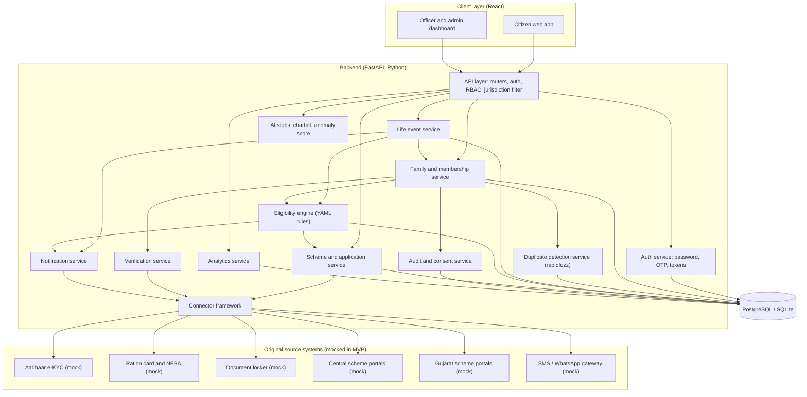

### 1.2 Execution Topology Diagram (Local & Containerized)
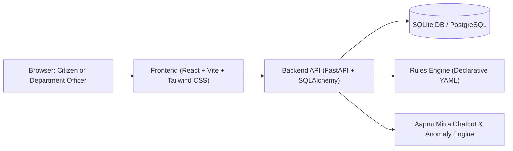

---

## 🚀 2. Core Functional Modules & User Flows

### 2.1 Unified Common Login Portal & Intelligent Role Routing
- **Dual-Mode Sign-In**: Supports sign-in via **10-Digit Citizen Mobile Number + Password** or **Gmail / Google Account OAuth (Simulated)**.
- **Unified Portal for Citizens & Officers**: Single portal handles both citizen families and government officials.
- **Intelligent Role-Based Routing**:
  - Official Department Emails (e.g. `admin@gujarat.gov.in`) automatically route to the **Departmental Officer Console** (`/officer`).
  - Family Mobile & Citizen logins automatically route to the **Citizen Family Portal** (`/my-family`).
- **First-Time Registration & Password Management**: Prompts first-time registrants to set up their password during family onboarding and enables authenticated password updates (`POST /api/v1/auth/password/change`).

### 2.2 Family & Membership Lifecycle
A family is tracked through an explicit state lifecycle ensuring only valid, verified households receive government benefits.

#### Family State Lifecycle Diagram
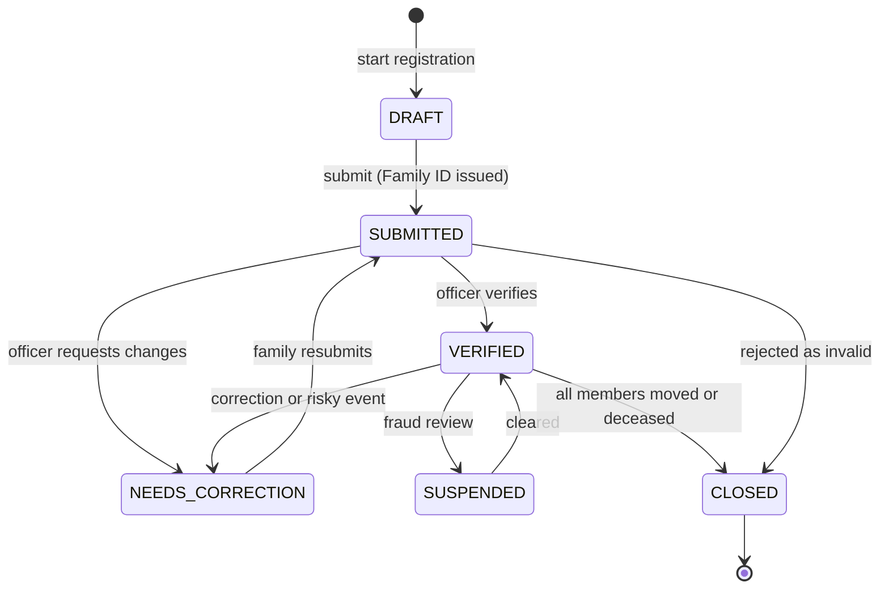

#### Duplicate Person Prevention Flow Diagram
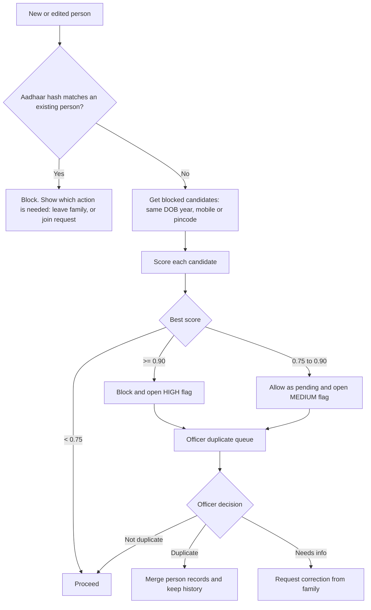

---

### 2.3 Household Division & Lineage Split Engine
When adult family members form independent nuclear households (e.g. upon marriage or economic division), citizens can initiate the 4-step **Family Split Wizard** (`FamilySplitWizardModal.tsx`):
1. **Select Moving Members**: Choose adult members and dependents leaving the original family.
2. **Nominate New Family Head**: Designate a verified adult to head the new household.
3. **Declare Address & Income**: Provide updated residential details, pincode, and household income band.
4. **Review & Automated Risk Assessment (0–100)**:
   - **Low Risk ($\le 50$)**: Immediate auto-approval with issuance of a new 12-Digit Verhoeff Family ID (`GJ-DD-YY-SSSSSSS-C`).
   - **High Risk ($> 50$)**: Formally submitted to the District Officer review queue.
   - Modal action buttons cleanly labeled **Close** for intuitive user navigation.
   - Preserves complete historical lineage records (`parent_family_id`, `child_family_id`).

#### Household Split Workflow Diagram
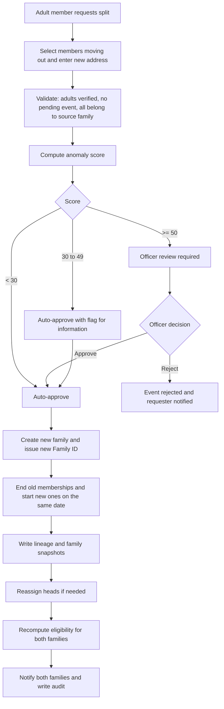

---

### 2.4 Automated Scheme Eligibility & Application Tracking
The platform continuously evaluates family profiles against Gujarat State and Central Government welfare schemes.

#### Eligibility Assessment State Lifecycle
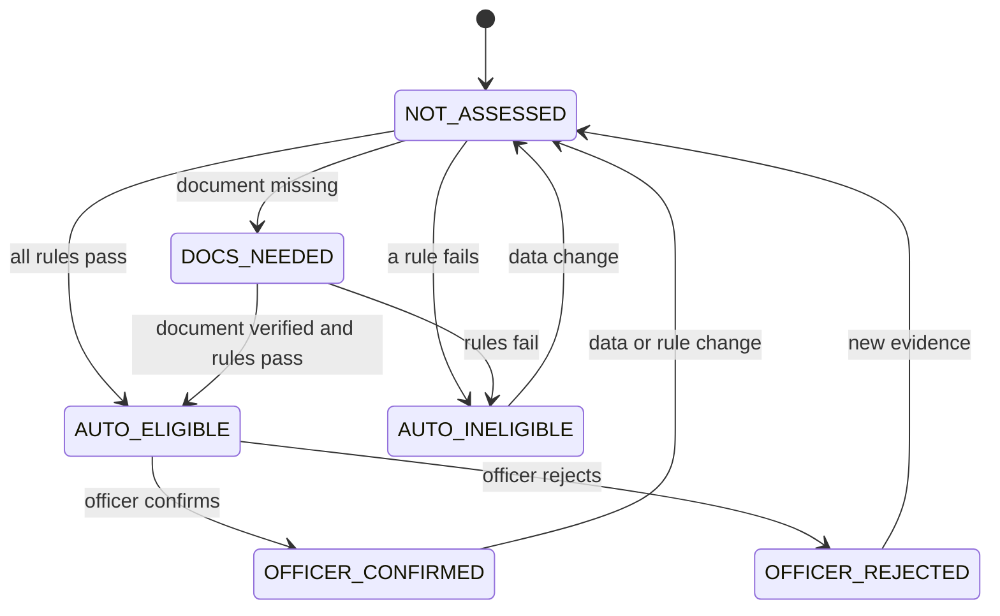

#### Application Tracking Lifecycle
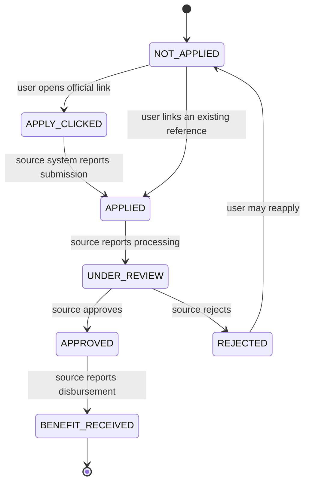

---

### 2.5 Aapnu Mitra AI Chatbot Widget
An interactive floating assistant widget (`AIChatbotWidget.tsx`) integrated across citizen and officer dashboards powered by `POST /api/v1/chatbot/query`:
- **High-Contrast Design**: Styled with a dark slate background (`bg-slate-900`) and high-visibility gold text (`text-amber-400`).
- **Real-Time Guidance**: Offers instant answers regarding state scheme criteria, document vault verifications, step-by-step lineage splits, and Family ID lookups.

---

## 📊 3. Entity-Relationship (ER) Diagram & Schema Overview

The underlying database ensures relational integrity between individuals, households, life events, scheme rules, and access audit trails.

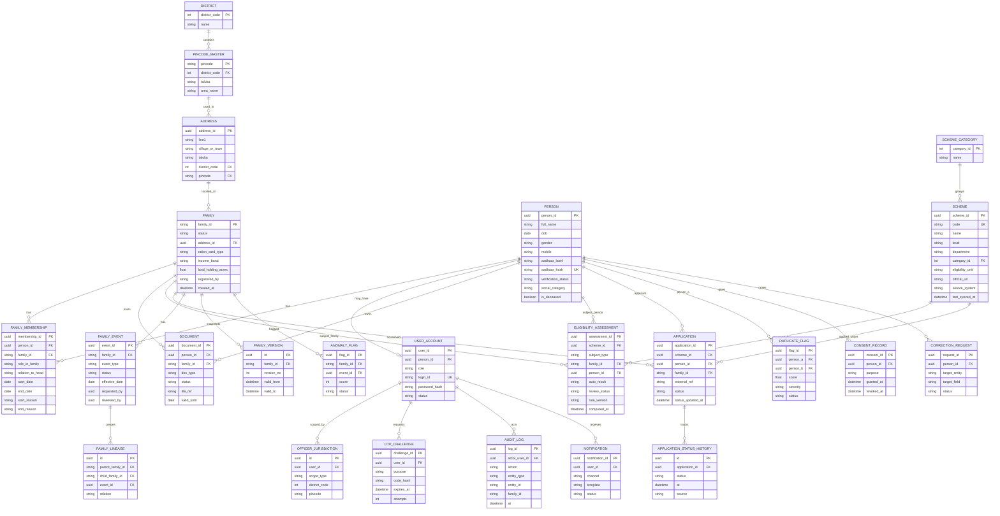

### Entity Summary
| Entity | Purpose | Key Attributes |
|---|---|---|
| **`PERSON`** | Permanent individual identity across life | `person_id`, `aadhaar_hash`, `full_name`, `dob`, `gender` |
| **`FAMILY`** | Household container | `family_id` (12-digit Verhoeff), `status`, `pincode`, `district_code` |
| **`MEMBERSHIP`** | Dated link connecting Person to Family | `membership_id`, `person_id`, `family_id`, `role`, `is_active` |
| **`LIFE_EVENT`** | Audit trail of family changes | `event_id`, `event_type` (SPLIT/BIRTH/DEATH), `parent_family_id`, `child_family_id` |
| **`SCHEME`** | Catalog of state & central schemes | `scheme_id`, `scheme_name`, `category`, `eligibility_unit` |
| **`SCHEME_ASSESSMENT`** | Computed eligibility results | `assessment_id`, `family_id`, `status`, `reasons` |
| **`AUDIT_LOG`** | Consent & privacy tracking log | `log_id`, `family_id`, `accessor_role`, `action`, `timestamp` |

---

## 🔄 4. Detailed Data Flow & Sequence Diagrams

### 4.1 Citizen & Officer Screen Navigation Flow
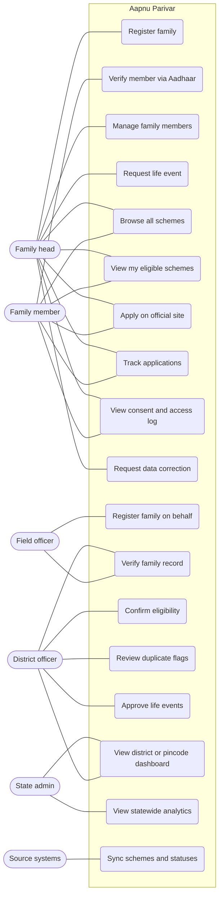

### 4.2 Login Navigation Flow
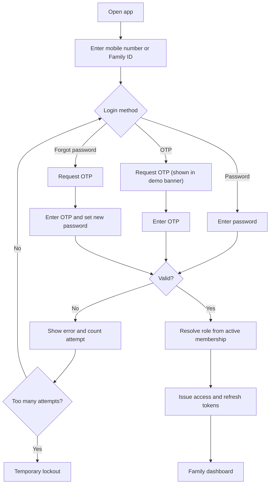

### 4.3 Family Registration Sequence Flow
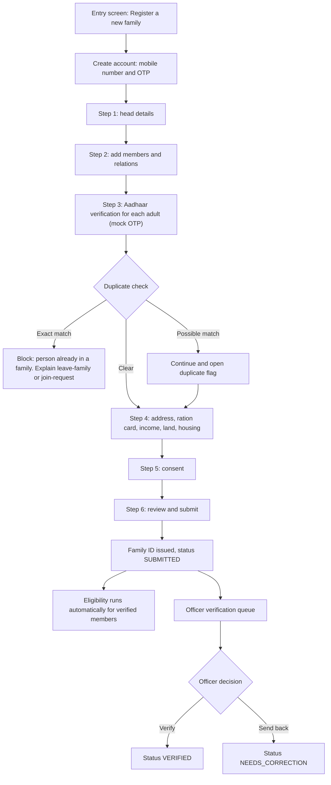

### 4.4 Member Aadhaar Verification Sequence
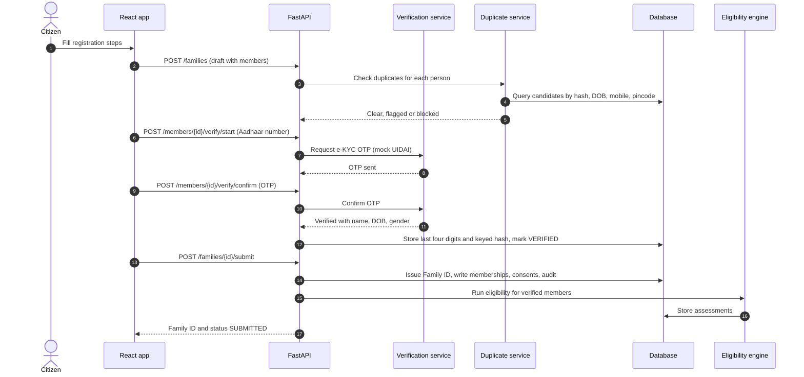

### 4.5 Citizen Scheme Discovery & Apply Flow
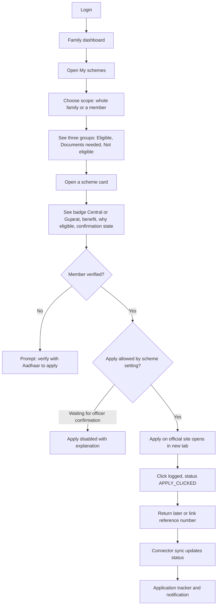

### 4.6 Eligibility Verification Sequence
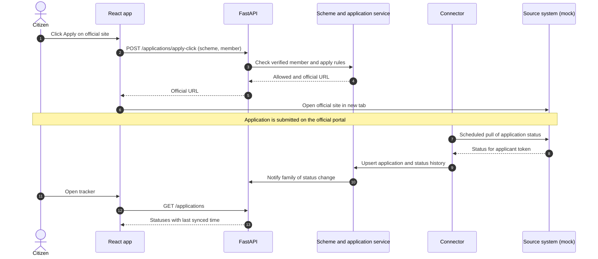

### 4.7 Household Split Sequence
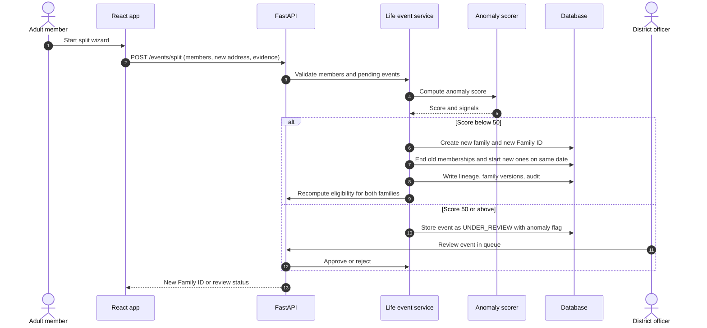

### 4.8 Officer Jurisdiction Dashboard Workflow
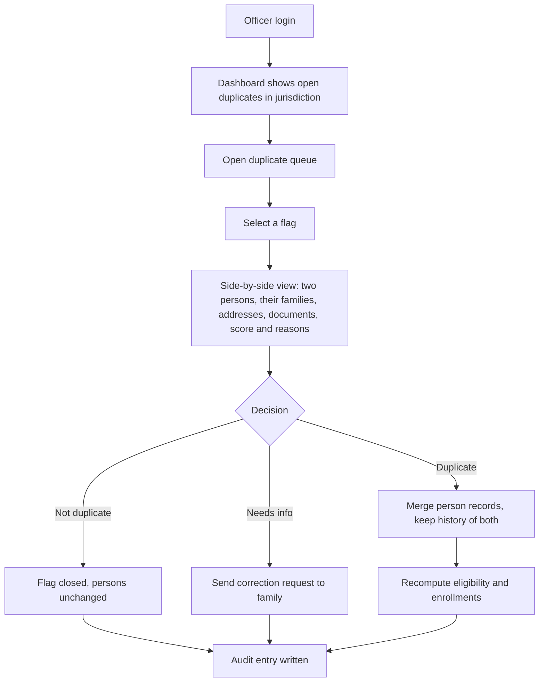

### 4.9 Privacy & Consent Audit Flow
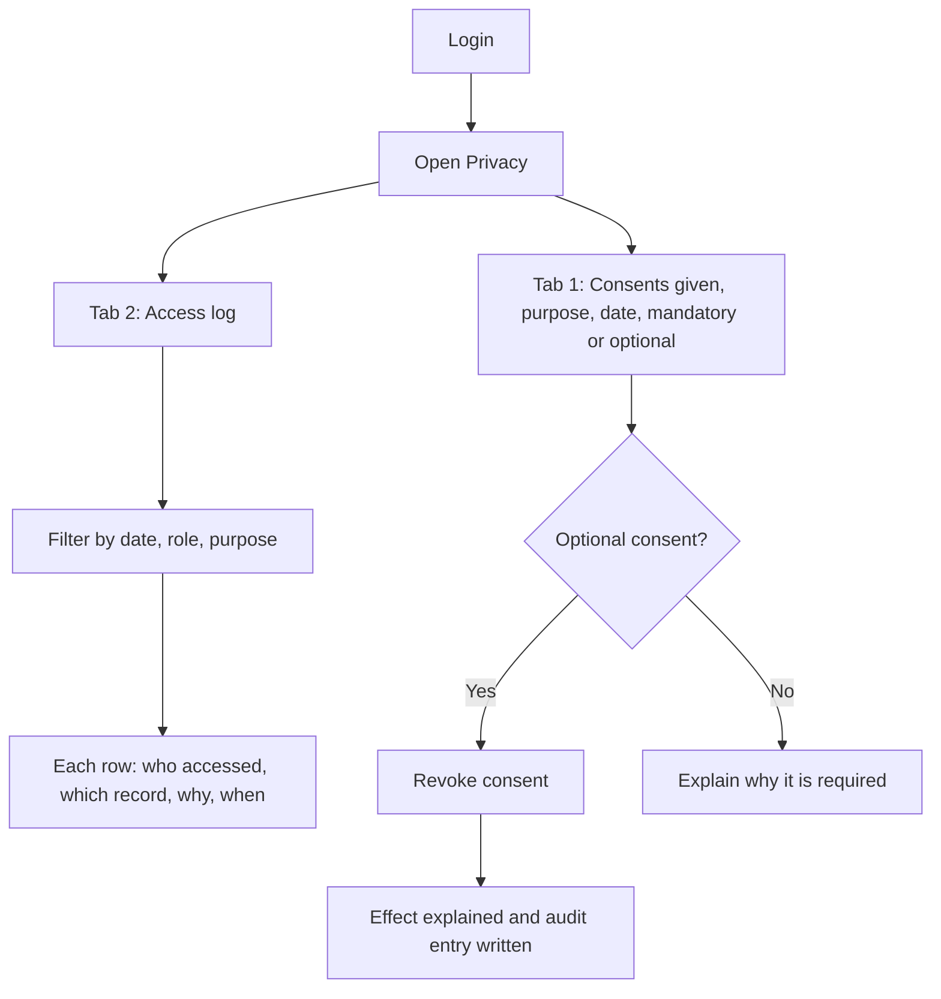

### 4.10 Comprehensive System Data Flow
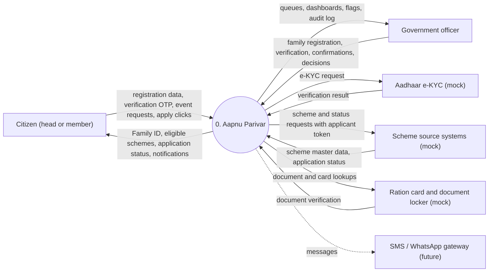

### 4.11 Aadhaar Verification & e-KYC Flow
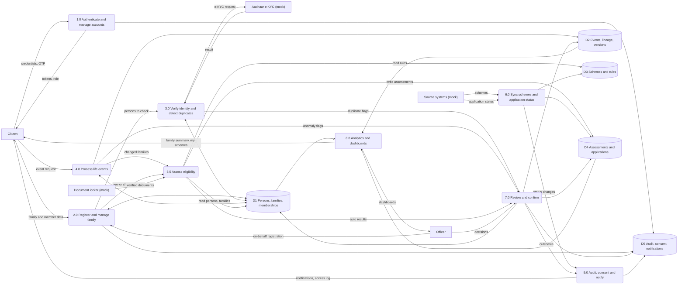

### 4.12 Automated Eligibility Engine Pipeline
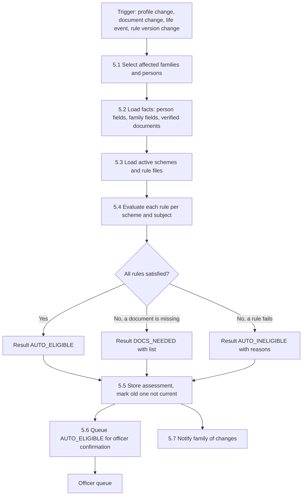

---

## 🔮 5. Future Architecture & Technical Roadmap

### 5.1 Strategic Roadmap Phases
| Phase | Milestone Focus | Deliverables |
|---|---|---|
| **Phase 1** | MVP Core Platform | English Web UI, Synthetic Data Generator, Verhoeff IDs, Split Engine, Officer Dashboard |
| **Phase 2** | Regional & Mobile Expansion | **Gujarati Localization (`gu`)**, SMS/WhatsApp OTP delivery, Field Officer PWA Offline Mode |
| **Phase 3** | National Integrations | Live Aadhaar e-KYC Vault, DigiLocker, Ration Card DB, State Direct Benefit Transfer (DBT) |
| **Phase 4** | Advanced AI & Analytics | Voice-enabled Gujarati AI Assistant, Machine Learning Anomaly Detection for splits |
| **Phase 5** | Statewide Scalability | Microservice Architecture, API Gateway, Distributed Message Queue, Multi-zone DB |

### 5.2 Enterprise Distributed Microservices Architecture
```mermaid
flowchart TB
  subgraph EDGE["Edge"]
    WEB["Web and PWA (Gujarati and English)"]
    MOB["Mobile app"]
    KIOSK["Field officer offline app"]
  end

  GW["API gateway: authentication, rate limits, routing"]

  subgraph SVC["Services"]
    IDS["Identity and family service"]
    EVS["Life event service"]
    ELS["Eligibility service"]
    CNS["Connector service"]
    NTS["Notification service"]
    CMS["Consent manager"]
    ANS["Analytics service"]
    AIS["AI service: chatbot, anomaly, matching"]
  end

  BUS[["Message queue / event stream"]]

  subgraph DATA["Data"]
    PG[("PostgreSQL, partitioned by district")]
    SRCH[("Search index")]
    CACHE[("Cache")]
    VAULT[("Aadhaar data vault")]
    WH[("Analytics warehouse")]
    OBJ[("Encrypted document store")]
  end

  subgraph EXT["External systems"]
    AUTH["Aadhaar authentication"]
    RAT["Ration card and NFSA"]
    DLK["Document locker"]
    PORT["Scheme portals and DBT"]
    MSG["SMS and WhatsApp providers"]
  end

  WEB --> GW
  MOB --> GW
  KIOSK --> GW
  GW --> IDS
  GW --> EVS
  GW --> ELS
  GW --> ANS
  GW --> AIS
  IDS --> BUS
  EVS --> BUS
  BUS --> ELS
  BUS --> NTS
  BUS --> ANS
  ELS --> CNS
  IDS --> CMS
  CNS --> AUTH
  CNS --> RAT
  CNS --> DLK
  CNS --> PORT
  NTS --> MSG
  IDS --> PG
  EVS --> PG
  ELS --> PG
  IDS --> VAULT
  IDS --> SRCH
  IDS --> CACHE
  ANS --> WH
  IDS --> OBJ
```

---

## 🛠️ 6. Quick Start & Local Development

### Prerequisites
- **Python 3.10+**
- **Node.js 18+ & npm**

### 1. Backend Setup (FastAPI)
```bash
cd backend
python -m venv venv

# Windows
venv\Scripts\activate
# Linux/macOS
source venv/bin/activate

pip install -r requirements.txt

# Seed synthetic Gujarat households
python -m app.seed.synthetic_generator

# Start API server
uvicorn app.main:app --reload --port 8000
```

### 2. Frontend Setup (React + Vite)
```bash
cd frontend
npm install
npm run dev
```
Open **`http://localhost:5173`** in your browser.

### 3. Run Automated Tests
```bash
cd backend
pytest
```

---

## 🔑 7. Default Demo Credentials

Use these pre-seeded credentials to explore and test the platform:

### 🏛️ Government Official & Admin Logins
*(Routes automatically to the **Departmental Officer Console** at `/officer`)*

| Role | Login Identifier | Default Password | Jurisdiction Scope |
|---|---|---|---|
| **State Admin** | `admin@gujarat.gov.in` | `Admin@123` | Statewide (All Gujarat Districts) |
| **District Officer** | `district07@gujarat.gov.in` | `District@123` | District 07 (Bhavnagar) |
| **Field Officer** | `field0701@gujarat.gov.in` | `Field@123` | Pincode 364001 |

### 🏡 Citizen & Family Portal Login
*(Routes automatically to the **Citizen Family Portal** at `/my-family`)*

| Role | Login Identifier | Default Password | Access Features |
|---|---|---|---|
| **Family Head** | `9876543210` | `Citizen@123` | Household Entitlements, Verhoeff Family ID, Member Roster, 4-Step Household Split Wizard, Document Vault, and **Aapnu Mitra AI Chatbot** |

### 💡 Google OAuth (Gmail) Login Simulation
- Signing in via the **Google Sign-In** tab using an official email ending in `@gujarat.gov.in` (e.g. `admin@gujarat.gov.in`) automatically grants **Officer Dashboard** access.
- Signing in using any standard Gmail address (e.g. `citizen@gmail.com`) automatically routes to the **Citizen Family Portal**.

---

*Aapnu Parivar — One Family. One ID. Every Benefit.*
